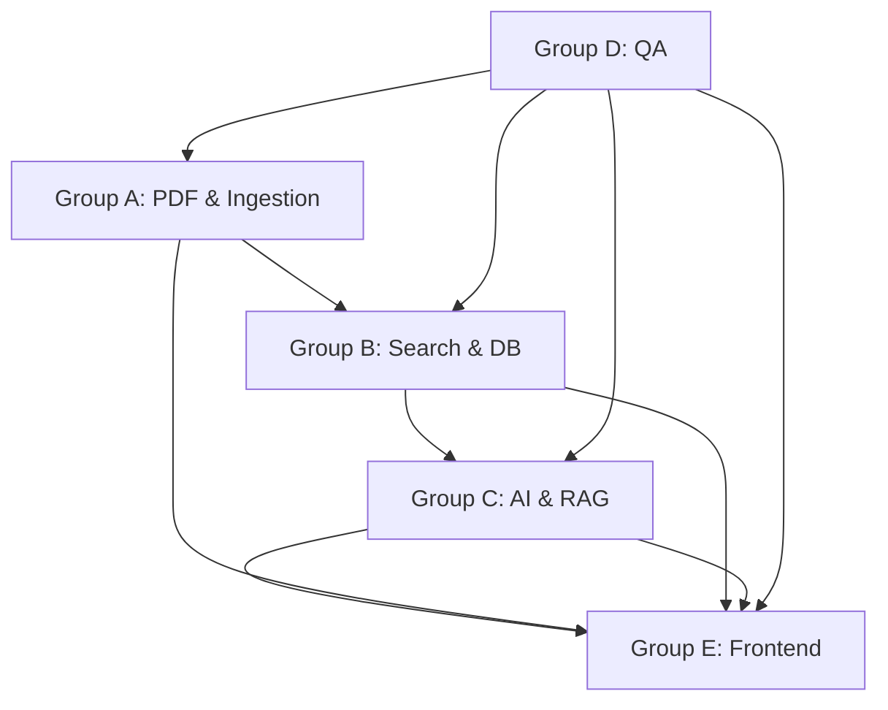

# Legal Assistant - Team Task Categorization (5 Groups of 2)

> **Project**: AI-Powered Legal Research & Petition Drafting Platform  
> **Team Size**: 10 Members (5 Groups of 2)    
> **Last Updated**: January 12, 2026

---

## 🎯 Team Organization

Our team is organized into **5 strategic units**. Each group consists of **2 members** to allow for peer review, pair programming, and knowledge sharing.

---

## 👥 Group Structure

### **Group A: PDF Engineering & Document Ingestion**
**Members**: Member 1 (Lead), Member 2 (Developer)  
**Focus**: Converting raw legal PDFs (BNS, BNSS, BSA) into structured, searchable chunks.

#### **Task 1: Smart PDF Parser Development**
Build the multi-strategy parser using `pdfplumber` and Groq Vision to detect sections, illustrations, provisos, and schedules.

**Responsibilities**:
- **Member 1**: Design parser architecture, mode detection algorithm, strategy pattern implementation
- **Member 2**: Implement 3 parsing strategies (Narrative, Strict, Schedule), text enrichment, OCR fallback

**Deliverables**:
- `app/parser/manager.py` - Main orchestrator
- `app/parser/strategies/narrative.py` - BNS/BSA parser
- `app/parser/strategies/strict.py` - BNSS/Tax Acts parser
- `app/parser/strategies/schedule.py` - PMLA/Schedule parser
- `app/parser/extractors/vision_extractor.py` - Groq Vision OCR
- `app/parser/enrichers/text_enricher.py` - Context prepending

**Content Covered**:
- Section detection regex patterns
- Illustration/Proviso attachment logic
- Schedule table parsing
- Vision LLM integration for scanned PDFs
- Text enrichment: `[Act] > [Chapter] > [Section]`

---

#### **Task 2: Embedding & Ingestion Pipeline**
Develop the embedding service and batch ingestion pipeline with progress tracking.

**Responsibilities**:
- **Member 1**: Design ingestion workflow, job queue management, error handling strategy
- **Member 2**: Implement Mistral embedding service, batch processing, CLI script, MongoDB upsert

**Deliverables**:
- `app/services/embedding_service.py` - Mistral API integration
- `app/services/ingestion_service.py` - Batch processing logic
- `scripts/ingest_batch.py` - CLI batch ingestion
- `app/api/ingestion_routes.py` - API endpoints

**Content Covered**:
- Mistral embedding API (1024-dim vectors)
- Batch processing with retry logic
- Progress tracking and status updates
- MongoDB bulk upsert operations
- Job queue management

**API Validation**: See [API_UI_VALIDATION_MATRIX.md](./API_UI_VALIDATION_MATRIX.md#feature-1-document-ingestion)

---

### **Group B: MongoDB Atlas & Retrieval Specialists**
**Members**: Member 3 (Search Engineer), Member 4 (Database Engineer)  
**Focus**: The "Search Brain" of the system - hybrid retrieval and database optimization.

#### **Task 1: Hybrid Search Engine Development**
Configure MongoDB Atlas Vector Search and BM25, then build the RRF (Reciprocal Rank Fusion) merger.

**Responsibilities**:
- **Member 3**: Implement vector search, BM25 search, RRF algorithm, Cohere reranking
- **Member 4**: Create MongoDB indexes, optimize queries, design schema, performance tuning

**Deliverables**:
- `app/services/vector_search.py` - Atlas Vector Search
- `app/services/bm25_search.py` - Atlas Text Search
- `app/services/rrf_merger.py` - RRF algorithm
- `app/services/retriever.py` - Hybrid orchestrator
- `app/services/reranker.py` - Cohere integration
- MongoDB Vector Index (1024-dim, cosine)
- MongoDB BM25 Text Index

**Content Covered**:
- MongoDB Atlas Vector Search (`$vectorSearch`)
- MongoDB Atlas Text Search (`$search`)
- RRF formula: `1 / (k + rank_i)`
- Weighted merging (0.6 Vector + 0.4 BM25)
- Cohere rerank-english-v3.0
- Score normalization (MinMax)

---

#### **Task 2: Database Schema & Performance Optimization**
Design the unified schema for laws and judgments, create indexes, and optimize query performance.

**Responsibilities**:
- **Member 4**: Schema design, index creation, migration scripts, performance monitoring
- **Member 3**: Query optimization, caching strategy (Redis), autocomplete service

**Deliverables**:
- `app/models/legal_chunk.py` - Pydantic models
- `app/models/judgment_chunk.py` - Judgment schema
- `app/services/database.py` - Motor async client
- `scripts/migrate_schema.py` - Migration automation
- `scripts/create_indexes.py` - Index automation
- `app/services/autocomplete_service.py` - Autocomplete

**Content Covered**:
- Normalized JSON schema (laws + judgments)
- Pydantic validation models
- Motor async MongoDB driver
- Index optimization strategies
- Redis caching for embeddings
- Autocomplete with prefix matching

**API Validation**: See [API_UI_VALIDATION_MATRIX.md](./API_UI_VALIDATION_MATRIX.md#feature-2-search)

---

### **Group C: AI Orchestration & RAG Pipeline**
**Members**: Member 5 (LLM Engineer), Member 6 (Backend Developer)  
**Focus**: Building the "Brain" using LangChain, Groq LLM, and conversational memory.

#### **Task 1: Core RAG Pipeline & Memory Management**
Develop the LangChain RAG chain with Groq LLM and MongoDB-backed conversation memory.

**Responsibilities**:
- **Member 5**: LLM integration, RAG chain design, prompt engineering, memory strategy
- **Member 6**: Memory implementation, session management, API endpoints, streaming support

**Deliverables**:
- `app/services/llm_engine.py` - Groq LLM integration
- `app/services/memory_manager.py` - MongoDB chat history
- `app/services/rag_chain.py` - LangChain RAG
- `app/services/prompts/chat_prompt.py` - System prompts
- `app/api/chat_routes.py` - Chat API

**Content Covered**:
- Groq API (Llama-3.3-70b-versatile)
- LangChain `ChatGroq` wrapper
- `ConversationSummaryBufferMemory`
- MongoDB-backed chat history
- History-aware retrieval
- Context injection and source tracking

---

#### **Task 2: Advanced Legal Features (Viability, Arguments, Clauses)**
Build specialized AI features for case prediction, argument mining, and clause search.

**Responsibilities**:
- **Member 5**: Design algorithms, prompt engineering, LLM orchestration for advanced features
- **Member 6**: Implement API endpoints, integrate with retrieval, build response formatters

**Deliverables**:
- `app/services/viability_service.py` - Case outcome prediction
- `app/services/argument_service.py` - Argument extraction
- `app/services/clause_service.py` - Clause search
- `app/services/prompts/viability_prompt.py` - Prompts
- `app/services/prompts/argument_prompt.py` - Prompts
- `app/services/prompts/clause_prompt.py` - Prompts
- `app/api/viability_routes.py` - API endpoints
- `app/api/argument_routes.py` - API endpoints
- `app/api/clause_routes.py` - API endpoints

**Content Covered**:
- Viability prediction algorithm (majority voting)
- Argument classification (prosecution/defense)
- Winning strategy identification
- Exact clause retrieval
- Judgment-based reasoning

**API Validation**: See [API_UI_VALIDATION_MATRIX.md](./API_UI_VALIDATION_MATRIX.md#feature-3-legal-chat)

---

### **Group D: Quality Assurance & Testing**
**Members**: Member 7 (QA Lead), Member 8 (Test Engineer)  
**Focus**: Ensuring the system produces reliable, accurate legal information through comprehensive testing.

#### **Task 1: API & Integration Testing**
Build comprehensive test suites for all backend services and API endpoints.

**Responsibilities**:
- **Member 7**: Test strategy, test plan, API validation, Postman collections
- **Member 8**: Unit tests, integration tests, pytest automation, test fixtures

**Deliverables**:
- `tests/test_parser.py` - Parser unit tests
- `tests/test_search.py` - Search service tests
- `tests/test_retriever.py` - Retrieval tests
- `tests/test_api.py` - API integration tests
- `tests/conftest.py` - Pytest configuration
- `tests/fixtures/` - Test data
- `postman/Legal_Assistant.postman_collection.json`

**Content Covered**:
- pytest framework
- FastAPI TestClient
- Mocking MongoDB queries
- Testing async functions
- API endpoint validation
- Error scenario testing
- Test coverage reporting (>80%)

---

#### **Task 2: UI Testing & End-to-End Validation**
Validate all UI components and complete user flows from API to UI.

**Responsibilities**:
- **Member 7**: E2E test design, manual UI testing, screenshot documentation, bug tracking
- **Member 8**: Playwright automation, component tests, performance testing

**Deliverables**:
- `e2e/ingestion.spec.js` - Ingestion flow tests
- `e2e/search.spec.js` - Search flow tests
- `e2e/chat.spec.js` - Chat flow tests
- `playwright.config.js` - Playwright setup
- `docs/TEST_PLAN.md` - Test strategy
- `docs/TEST_CASES.md` - Test cases
- UI screenshots for all features

**Content Covered**:
- Playwright E2E testing
- Browser automation
- Visual regression testing
- Screenshot comparison
- Manual UI validation
- Bug reporting workflow
- Performance benchmarking

**UI Validation**: See [API_UI_VALIDATION_MATRIX.md](./API_UI_VALIDATION_MATRIX.md)

---

### **Group E: Frontend & User Experience**
**Members**: Member 9 (Frontend Lead), Member 10 (UI Developer)  
**Focus**: The user experience and the final deliverable - a beautiful, intuitive React interface.

#### **Task 1: React Application Architecture & Core Components**
Build the React application framework with Material UI and core reusable components.

**Responsibilities**:
- **Member 9**: Architecture design, routing, state management, theme, API client
- **Member 10**: Component library, common UI elements, layout components

**Deliverables**:
- `frontend/src/App.jsx` - Main application
- `frontend/src/theme/theme.js` - MUI theme (Enterprise Blue)
- `frontend/src/routes.jsx` - Routing configuration
- `frontend/src/stores/` - Zustand state stores
- `frontend/src/services/api.js` - Axios client
- `frontend/src/components/common/` - Reusable components
- `frontend/src/components/layout/` - Layout components

**Content Covered**:
- React 18 + Vite setup
- Material UI (MUI) theming
- React Router v6
- Zustand state management
- TanStack Query (React Query)
- Axios HTTP client
- Component composition patterns

---

#### **Task 2: Feature UI Development (6 Tabs)**
Develop the UI for all 6 features: Ingestion, Search, Chat, Viability, Arguments, Clauses.

**Responsibilities**:
- **Member 9**: Ingestion UI, Search UI, Chat UI (complex interactions)
- **Member 10**: Viability UI, Arguments UI, Clauses UI (form-heavy features)

**Deliverables**:
- `frontend/src/components/ingestion/` - Upload, progress tracking
- `frontend/src/components/search/` - Search bar, filters, results
- `frontend/src/components/chat/` - Chat interface, source chips
- `frontend/src/components/viability/` - Prediction form, results
- `frontend/src/components/arguments/` - Argument display
- `frontend/src/components/clauses/` - Clause search, copy

**Content Covered**:
- react-dropzone for file upload
- MUI TextField, Autocomplete, Card
- Real-time progress polling
- Pagination components
- Chat message rendering
- Source citation chips
- Form handling (React Hook Form + Zod)
- Copy-to-clipboard functionality
- Responsive design (mobile + desktop)

**UI Validation**: See [API_UI_VALIDATION_MATRIX.md](./API_UI_VALIDATION_MATRIX.md)

---

## 📅 Enterprise Project Timeline (8-Week Sprint)

| Group | Week 1-2 | Week 3-4 | Week 5-6 | Week 7-8 |
|-------|----------|----------|----------|----------|
| **A: PDF & Ingestion** | PDF Parser Prototype (3 strategies) | Embedding Service & Batch Pipeline | CLI Script & Error Handling | Testing & Optimization |
| **B: Search & DB** | MongoDB Schema & Vector Index Setup | Hybrid Search & RRF Implementation | Autocomplete & Caching | Performance Tuning |
| **C: AI & RAG** | LLM Integration & RAG Chain | Memory Management & Chat API | Advanced Features (Viability, Arguments, Clauses) | Prompt Optimization |
| **D: QA & Testing** | Test Strategy & Framework Setup | API Testing & Postman Collections | UI Testing & E2E Automation | Full Regression Testing |
| **E: Frontend** | React Framework & Component Library | Ingestion & Search UI | Chat & Advanced Features UI | Polish & Responsive Design |

---

## 🔄 Daily Workflow

### **Daily Standup** (15 minutes)
Each group reports:
1. What did we complete yesterday?
2. What will we work on today?
3. Any blockers?

### **Pair Programming**
- Groups work together on complex tasks
- Code reviews within the group before PR
- Knowledge sharing sessions

### **Weekly Sync** (Friday)
- Demo completed features
- Integration testing across groups
- Plan next week's tasks

---

## 🎯 Group Dependencies

**Key Dependencies**:
- **Group A** must complete PDF parsing before **Group B** can test search
- **Group B** must complete retrieval before **Group C** can build RAG
- **Group C** must complete APIs before **Group E** can build UI
- **Group D** validates all groups continuously

---

## ✅ Definition of Done (Per Task)

A task is considered "done" when:
- [ ] Code is written and tested by both group members
- [ ] Unit tests pass (>80% coverage)
- [ ] **API validation complete** (Postman/curl tests pass)
- [ ] **UI validation complete** (Manual testing + screenshots) *[if applicable]*
- [ ] **End-to-end validation** (API → UI flow working) *[if applicable]*
- [ ] Code review approved by peer in group
- [ ] Code review approved by Tech Lead (Member 1)
- [ ] Documentation updated
- [ ] Integration tests pass
- [ ] Deployed to staging

> **📋 Validation Reference**: See [API_UI_VALIDATION_MATRIX.md](./API_UI_VALIDATION_MATRIX.md) for detailed validation requirements.

---

## 📊 Success Metrics

### **Group A: PDF & Ingestion**
- ✅ Parser accuracy: >95% for all 3 strategies
- ✅ Ingestion speed: >100 pages/minute
- ✅ OCR fallback success: >90%

### **Group B: Search & DB**
- ✅ Search latency: <500ms (p95)
- ✅ Search accuracy: >90% relevance
- ✅ Index query time: <100ms

### **Group C: AI & RAG**
- ✅ Chat response time: <5 seconds
- ✅ Source citation accuracy: >95%
- ✅ Memory context retention: 10 turns

### **Group D: QA**
- ✅ Test coverage: >80%
- ✅ Bug detection rate: >95%
- ✅ E2E test pass rate: 100%

### **Group E: Frontend**
- ✅ UI load time: <2 seconds
- ✅ Mobile responsive: 100%
- ✅ User satisfaction: >90%

---

## 🚨 Risk Management

| Risk | Mitigation | Owner Group |
|------|------------|-------------|
| PDF parsing accuracy | Extensive testing with real PDFs, manual validation | Group A |
| MongoDB performance | Index optimization, query tuning, caching | Group B |
| LLM API rate limits | Implement caching, use fallback providers | Group C |
| Integration issues | Regular cross-group testing, clear API contracts | Group D |
| UI/UX complexity | Early prototypes, user feedback, iterative design | Group E |

---

## 📚 Knowledge Sharing

### **Weekly Tech Talks** (30 min, Fridays)
- **Week 2**: PDF parsing strategies (Group A)
- **Week 3**: Hybrid search deep dive (Group B)
- **Week 4**: RAG pipeline architecture (Group C)
- **Week 5**: Testing best practices (Group D)
- **Week 6**: React component patterns (Group E)

---

## 🔧 Tools & Technologies

### **Group A: PDF & Ingestion**
- pdfplumber, Pillow, pdf2image
- Groq Vision API (Llama-3.2-11b-vision)
- Mistral Embeddings API
- Python, FastAPI

### **Group B: Search & DB**
- MongoDB Atlas (Vector Search + Text Search)
- Motor (async MongoDB driver)
- Cohere Rerank API
- Redis (caching)

### **Group C: AI & RAG**
- LangChain
- Groq API (Llama-3.3-70b)
- MongoDB (chat history)
- FastAPI

### **Group D: QA**
- pytest, pytest-asyncio
- Playwright
- Postman, Newman
- Vitest, React Testing Library

### **Group E: Frontend**
- React 18, Vite
- Material UI (MUI)
- Zustand, TanStack Query
- Axios, React Router

---

## 📞 Communication Channels

### **Group Channels** (Slack/Discord)
- `#group-a-pdf-ingestion`
- `#group-b-search-db`
- `#group-c-ai-rag`
- `#group-d-qa-testing`
- `#group-e-frontend`

### **Cross-Group Channels**
- `#tech-leads` - Group leads coordination
- `#integration` - Cross-group integration issues
- `#general` - Team-wide announcements

---

## 🎓 Onboarding New Group Members

If a new member joins a group:

**Day 1**:
- Read this document (their group section)
- Read [VALIDATION_STRATEGY.md](./VALIDATION_STRATEGY.md)
- Meet with group partner

**Day 2**:
- Setup environment using [TECHSTACK.md](./TECHSTACK.md)
- Review [ARCHITECTURE.md](./ARCHITECTURE.md)
- Review existing code with partner

**Day 3**:
- Study [API_UI_VALIDATION_MATRIX.md](./API_UI_VALIDATION_MATRIX.md)
- Start pair programming on current task
- Attend daily standup

---

## 📈 Progress Tracking

### **GitHub Projects Board**
- **Backlog**: All tasks from this document
- **In Progress**: Currently being worked on
- **In Review**: Code review by partner
- **QA Validation**: Being tested by Group D
- **Done**: All validations passed

### **Labels**
- `group-a`, `group-b`, `group-c`, `group-d`, `group-e`
- `api-validation`, `ui-validation`, `e2e-validation`
- `bug`, `enhancement`, `documentation`
- `blocked`, `urgent`, `help-wanted`

---

## 🏆 Team Values

✅ **Collaboration**: Work together, help each other, share knowledge

✅ **Quality**: Don't compromise on testing and validation

✅ **Communication**: Speak up early about blockers and issues

✅ **Ownership**: Take pride in your group's deliverables

✅ **Continuous Learning**: Share what you learn with the team

---

*This task categorization is designed to maximize collaboration within groups while maintaining clear responsibilities and dependencies across groups. Regular communication and peer review are essential for success.*
