# API & UI Validation Matrix

> **Critical Requirement**: Every feature MUST be validated at both API and UI levels before marking as complete.

---

## 🔍 Validation Workflow

```mermaid
flowchart LR
    A[Backend Dev: API Implementation] --> B[Backend Dev: API Testing]
    B --> C[QA: API Validation]
    C --> D[Frontend Dev: UI Implementation]
    D --> E[Frontend Dev: UI Testing]
    E --> F[QA: UI Validation]
    F --> G[QA: E2E Validation]
    G --> H{All Tests Pass?}
    H -- Yes --> I[Feature Complete ✅]
    H -- No --> J[Bug Fix Required]
    J --> B
```



---

## Feature 1: Document Ingestion

### **API Validation** (Member 2 + Member 9)

#### **Endpoint**: `POST /api/v1/ingest`

**Test Cases**:
- [ ] Upload single PDF file (< 10MB)
- [ ] Upload multiple PDF files (batch)
- [ ] Reject files > 10MB with 400 error
- [ ] Reject non-PDF files with 400 error
- [ ] Return valid `job_id` (UUID format)
- [ ] Handle duplicate file names gracefully
- [ ] Return 500 on server error

**Validation Method**: Postman/curl

**Example Request**:
```bash
curl -X POST http://localhost:8000/api/v1/ingest \
  -F "files=@BNS.pdf" \
  -F "files=@IPC.pdf"
```

**Expected Response** (200 OK):
```json
{
  "job_id": "550e8400-e29b-41d4-a716-446655440000",
  "status": "queued",
  "total_files": 2,
  "message": "Ingestion job started successfully"
}
```

**Error Response** (400 Bad Request):
```json
{
  "detail": "File size exceeds 10MB limit",
  "rejected_files": ["large_file.pdf"]
}
```

---

#### **Endpoint**: `GET /api/v1/ingest/status/{job_id}`

**Test Cases**:
- [ ] Return current processing status
- [ ] Show current file name being processed
- [ ] Show progress percentage (0-100)
- [ ] Show processed/total count
- [ ] Handle invalid job_id with 404 error
- [ ] Show error details if ingestion failed
- [ ] Return "completed" status when done

**Validation Method**: Postman/curl

**Example Request**:
```bash
curl -X GET http://localhost:8000/api/v1/ingest/status/550e8400-e29b-41d4-a716-446655440000
```

**Expected Response** (Processing):
```json
{
  "job_id": "550e8400-e29b-41d4-a716-446655440000",
  "status": "processing",
  "current_file": "BNS.pdf",
  "file_progress": 45,
  "processed_count": 1,
  "total_files": 2,
  "errors": [],
  "started_at": "2026-01-12T17:00:00Z"
}
```

**Expected Response** (Completed):
```json
{
  "job_id": "550e8400-e29b-41d4-a716-446655440000",
  "status": "completed",
  "processed_count": 2,
  "total_files": 2,
  "total_chunks_created": 1523,
  "errors": [],
  "completed_at": "2026-01-12T17:15:00Z"
}
```

---

### **UI Validation** (Member 6 + Member 9)

**Component**: `FileUpload.jsx`

**Test Cases**:
- [ ] Drag-and-drop zone visible with clear instructions
- [ ] Click to browse files works
- [ ] File list displays uploaded files with names and sizes
- [ ] File size validation shows error message
- [ ] File type validation shows error message
- [ ] Progress bar updates in real-time (polling every 2s)
- [ ] Current file name displays during processing
- [ ] Success notification appears on completion
- [ ] Error notification appears on failure
- [ ] Retry button appears on error
- [ ] Upload button disabled during processing
- [ ] Cancel button works (stops polling)

**Validation Method**: Manual testing + screenshots

**Screenshots Required**:
1. **Empty upload state** - Shows drag-drop zone
2. **Files selected** - Before upload, showing file list
3. **Upload in progress** - Progress bar at 45%
4. **Upload complete** - Success message with checkmark
5. **Upload error** - Error message with retry button
6. **File validation error** - Red error for invalid file

**UI States to Test**:
- Empty state
- Files selected (not uploaded)
- Uploading (with progress)
- Success state
- Error state
- Retry state

---

### **End-to-End Validation** (Member 9)

**Flow**: Upload PDF → Track Progress → Verify in MongoDB

**Test Steps**:
1. Open Ingestion tab in UI
2. Drag and drop `BNS.pdf` into upload zone
3. Verify file appears in file list
4. Click "Upload" button
5. Verify progress bar starts updating
6. Verify current file name shows "BNS.pdf"
7. Wait for completion notification
8. Check MongoDB: `db.legal_chunks.find({"metadata.act_name": "Bharatiya Nyaya Sanhita"})`
9. Verify chunks have embeddings (non-null)
10. Verify metadata is correct (act_name, section_id, etc.)

**Pass Criteria**:
- ✅ All chunks appear in MongoDB
- ✅ Embeddings are generated (1024-dim vectors)
- ✅ Metadata fields are populated correctly
- ✅ No errors in console or logs

---

## Feature 2: Search

### **API Validation** (Member 3 + Member 9)

#### **Endpoint**: `POST /api/v1/search`

**Test Cases**:
- [ ] Search with query only (no filters)
- [ ] Search with act_name filter
- [ ] Search with category filter
- [ ] Search with both filters
- [ ] Pagination works (page 1, 2, 3)
- [ ] Empty query returns 400 error
- [ ] No results returns empty array with 200
- [ ] Results include complete metadata
- [ ] Results include relevance scores
- [ ] Results sorted by relevance (descending)

**Validation Method**: Postman

**Example Request**:
```bash
curl -X POST http://localhost:8000/api/v1/search \
  -H "Content-Type: application/json" \
  -d '{
    "query": "punishment for murder",
    "filters": {
      "act_name": "Bharatiya Nyaya Sanhita, 2023"
    },
    "page": 1,
    "page_size": 10
  }'
```

**Expected Response** (200 OK):
```json
{
  "results": [
    {
      "section_id": "BNS_Sec_103",
      "title": "Murder",
      "content": "103. Murder. Whoever commits murder shall be punished with death or imprisonment for life...",
      "metadata": {
        "act_name": "Bharatiya Nyaya Sanhita, 2023",
        "category": "Criminal",
        "chapter": "VI - Of Offences Affecting Life",
        "section_id": "103",
        "has_illustration": true
      },
      "score": 0.89
    },
    {
      "section_id": "BNS_Sec_104",
      "title": "Punishment for murder by life-convict",
      "content": "104. Whoever, being under sentence of imprisonment for life...",
      "metadata": {
        "act_name": "Bharatiya Nyaya Sanhita, 2023",
        "category": "Criminal",
        "chapter": "VI - Of Offences Affecting Life",
        "section_id": "104"
      },
      "score": 0.76
    }
  ],
  "total": 15,
  "page": 1,
  "page_size": 10,
  "total_pages": 2
}
```

---

#### **Endpoint**: `GET /api/v1/autocomplete?q=sec`

**Test Cases**:
- [ ] Returns suggestions for "sec"
- [ ] Returns suggestions for "murder"
- [ ] Returns suggestions for "302"
- [ ] Limits to 10 suggestions
- [ ] Empty query returns empty array
- [ ] Case-insensitive matching
- [ ] Prefix matching works

**Example Request**:
```bash
curl -X GET "http://localhost:8000/api/v1/autocomplete?q=murder"
```

**Expected Response**:
```json
{
  "suggestions": [
    "Section 103 - Murder",
    "Section 104 - Punishment for murder by life-convict",
    "Section 105 - Punishment for culpable homicide not amounting to murder"
  ]
}
```

---

### **UI Validation** (Member 6 + Member 9)

**Component**: `SearchInterface.jsx`

**Test Cases**:
- [ ] Search bar accepts input
- [ ] Autocomplete dropdown appears after 2 characters
- [ ] Autocomplete suggestions are clickable
- [ ] Clicking suggestion fills search bar
- [ ] Filter panel shows/hides on click
- [ ] Act filter dropdown populated with acts
- [ ] Category filter dropdown works
- [ ] Search button triggers search
- [ ] Enter key triggers search
- [ ] Results display in cards
- [ ] Result cards show title, content preview, metadata
- [ ] Pagination controls appear when needed
- [ ] Page numbers are clickable
- [ ] Clicking result opens modal
- [ ] Modal shows full section text
- [ ] Modal has close button
- [ ] Empty state shows when no results
- [ ] Loading spinner shows during search
- [ ] Clear filters button resets all filters

**Screenshots Required**:
1. **Search bar with autocomplete** - Dropdown showing suggestions
2. **Filter panel expanded** - All filters visible
3. **Search results** - Multiple result cards
4. **Pagination controls** - Page 1 of 3
5. **Section detail modal** - Full section text
6. **Empty state** - "No results found" message
7. **Loading state** - Spinner during search

**UI States to Test**:
- Empty/initial state
- Typing (autocomplete showing)
- Loading state
- Results displayed
- No results state
- Modal open
- Filters applied

---

### **End-to-End Validation** (Member 9)

**Flow**: Type Query → See Autocomplete → Search → View Results → Open Modal

**Test Steps**:
1. Navigate to Search tab
2. Type "murder" in search bar
3. Verify autocomplete dropdown appears
4. Verify suggestions include "Section 103 - Murder"
5. Click on suggestion
6. Verify search bar fills with "Section 103 - Murder"
7. Click "Search" button
8. Verify loading spinner appears
9. Verify results appear (BNS Section 103 at top)
10. Verify result card shows title, preview, metadata
11. Click on result card
12. Verify modal opens with full section text
13. Verify modal shows metadata (act name, chapter)
14. Close modal
15. Test pagination (if multiple pages)

**Pass Criteria**:
- ✅ Complete flow works without errors
- ✅ Autocomplete is responsive (< 300ms)
- ✅ Search returns relevant results
- ✅ Results sorted by relevance
- ✅ Modal displays complete information

---

## Feature 3: Legal Chat

### **API Validation** (Member 4 + Member 9)

#### **Endpoint**: `POST /api/v1/chat`

**Test Cases**:
- [ ] New session (no session_id provided)
- [ ] Existing session (with session_id)
- [ ] Query returns answer
- [ ] Answer includes sources array
- [ ] Sources include section_id and act_name
- [ ] Memory persists across turns
- [ ] Follow-up questions use context
- [ ] Invalid session_id creates new session
- [ ] Empty query returns 400 error
- [ ] Long query (> 500 chars) works
- [ ] Special characters in query handled

**Validation Method**: Postman

**Example Request** (First message):
```bash
curl -X POST http://localhost:8000/api/v1/chat \
  -H "Content-Type: application/json" \
  -d '{
    "query": "What is the punishment for murder?"
  }'
```

**Expected Response**:
```json
{
  "session_id": "chat_550e8400-e29b-41d4-a716-446655440000",
  "answer": "According to Section 103 of the Bharatiya Nyaya Sanhita (BNS), 2023, whoever commits murder shall be punished with death or imprisonment for life, and shall also be liable to fine.",
  "sources": [
    {
      "section_id": "BNS_Sec_103",
      "act_name": "Bharatiya Nyaya Sanhita, 2023",
      "title": "Murder",
      "chapter": "VI - Of Offences Affecting Life",
      "relevance_score": 0.92
    }
  ],
  "timestamp": "2026-01-12T17:30:00Z"
}
```

**Example Request** (Follow-up):
```bash
curl -X POST http://localhost:8000/api/v1/chat \
  -H "Content-Type: application/json" \
  -d '{
    "session_id": "chat_550e8400-e29b-41d4-a716-446655440000",
    "query": "What about attempt to murder?"
  }'
```

**Expected Response** (with context):
```json
{
  "session_id": "chat_550e8400-e29b-41d4-a716-446655440000",
  "answer": "Regarding attempt to murder, Section 109 of BNS states that whoever attempts to commit murder shall be punished with imprisonment for life or imprisonment for a term which may extend to ten years, and shall also be liable to fine. This is different from the punishment for actual murder which I mentioned earlier.",
  "sources": [
    {
      "section_id": "BNS_Sec_109",
      "act_name": "Bharatiya Nyaya Sanhita, 2023",
      "title": "Attempt to murder",
      "relevance_score": 0.94
    }
  ],
  "timestamp": "2026-01-12T17:31:00Z"
}
```

---

### **UI Validation** (Member 6 + Member 9)

**Component**: `ChatInterface.jsx`

**Test Cases**:
- [ ] Chat input field visible and focused
- [ ] Send button enabled when text entered
- [ ] Send button disabled when input empty
- [ ] Enter key sends message
- [ ] User message appears immediately after send
- [ ] User message aligned to right
- [ ] Loading indicator shows while waiting for response
- [ ] Assistant message appears after response
- [ ] Assistant message aligned to left
- [ ] Source chips display below assistant message
- [ ] Source chips are clickable
- [ ] Clicking source chip opens modal with section details
- [ ] Modal shows complete section text
- [ ] "New Chat" button visible
- [ ] "New Chat" button clears history
- [ ] Auto-scroll to bottom on new message
- [ ] Multi-turn conversation displays correctly
- [ ] Timestamps show for each message
- [ ] Copy button on assistant messages works
- [ ] Messages persist on page refresh (same session)

**Screenshots Required**:
1. **Empty chat state** - Welcome message
2. **User message sent** - Message aligned right
3. **Loading state** - Typing indicator
4. **Assistant response** - Message with source chips
5. **Source chip modal** - Section details displayed
6. **Multi-turn conversation** - 3+ message pairs
7. **New chat confirmation** - Dialog before clearing

**UI States to Test**:
- Empty/welcome state
- User typing
- Message sent (loading)
- Response received
- Source modal open
- Multi-turn conversation
- New chat (cleared)

---

### **DeepEval Quality Evaluation** (Member 7 + Member 8)

**Purpose**: Validate AI-generated chat responses for quality, accuracy, and reliability using DeepEval framework.

**Metrics to Evaluate**:

#### **1. Faithfulness Metric**
Verify that answers are grounded in retrieved legal sources.

**Test Cases**:
- [ ] All claims in answer are supported by retrieved context
- [ ] No hallucinated legal information
- [ ] Exact legal language used from sources
- [ ] Section numbers match retrieved documents
- [ ] Punishments/provisions accurately quoted

**Threshold**: ≥ 0.8 (80% of claims must be grounded)

**Example Test**:
```python
test_case = LLMTestCase(
    input="What is the punishment for murder?",
    actual_output="According to Section 103 of BNS, murder is punishable with death or life imprisonment",
    retrieval_context=["Section 103: Murder. Whoever commits murder shall be punished with death or imprisonment for life..."]
)
faithfulness_metric = FaithfulnessMetric(threshold=0.8)
assert faithfulness_metric.measure(test_case) >= 0.8
```

---

#### **2. Answer Relevancy Metric**
Ensure answer directly addresses the user's legal query.

**Test Cases**:
- [ ] Answer addresses the specific question asked
- [ ] No generic or off-topic responses
- [ ] Relevant legal provisions cited
- [ ] Query intent understood correctly
- [ ] Follow-up context maintained

**Threshold**: ≥ 0.7 (70% relevance to query)

**Example Test**:
```python
test_case = LLMTestCase(
    input="What is the punishment for attempt to murder?",
    actual_output="According to Section 109 of BNS, attempt to murder is punishable with life imprisonment or up to 10 years, plus fine"
)
answer_relevancy_metric = AnswerRelevancyMetric(threshold=0.7)
assert answer_relevancy_metric.measure(test_case) >= 0.7
```

---

#### **3. Contextual Precision Metric**
Validate that retrieved context is accurate and relevant.

**Test Cases**:
- [ ] Retrieved sections are relevant to query
- [ ] No irrelevant legal provisions in context
- [ ] Correct act/chapter retrieved
- [ ] Similar sections not confused
- [ ] Context quality is high

**Threshold**: ≥ 0.75 (75% of context must be relevant)

**Example Test**:
```python
test_case = LLMTestCase(
    input="What is Section 138 of NI Act about?",
    expected_output="Dishonour of cheque for insufficiency of funds",
    retrieval_context=[
        "Section 138: Dishonour of cheque...",
        "Section 141: Offences by companies..."
    ]
)
contextual_precision_metric = ContextualPrecisionMetric(threshold=0.75)
assert contextual_precision_metric.measure(test_case) >= 0.75
```

---

#### **4. Contextual Recall Metric**
Ensure all relevant legal context is retrieved.

**Test Cases**:
- [ ] All necessary sections retrieved
- [ ] Related provisions included
- [ ] No missing relevant context
- [ ] Complete legal picture provided
- [ ] Cross-references captured

**Threshold**: ≥ 0.7 (70% of relevant context retrieved)

**Example Test**:
```python
test_case = LLMTestCase(
    input="What are the provisions for cheque bouncing?",
    expected_output="Sections 138, 141, and 142 of NI Act",
    retrieval_context=["Section 138...", "Section 141...", "Section 142..."]
)
contextual_recall_metric = ContextualRecallMetric(threshold=0.7)
assert contextual_recall_metric.measure(test_case) >= 0.7
```

---

**Overall Quality Score**:
```
Overall = (Faithfulness × 0.35) + (Answer Relevancy × 0.30) + 
          (Contextual Precision × 0.20) + (Contextual Recall × 0.15)
```

**Threshold**: ≥ 0.75 (75% overall quality)

---

**Regeneration Logic**:
- If any metric < threshold → Trigger regeneration (max 3 attempts)
- Log all scores to MongoDB for analysis
- Alert on repeated failures

**Validation Method**: Automated DeepEval tests + Manual review

**Deliverables**:
- `tests/test_chat_evaluation.py` - DeepEval test cases
- `scripts/evaluate_chat_responses.py` - Batch evaluation
- MongoDB evaluation logs
- Weekly quality reports

**Pass Criteria**:
- ✅ Faithfulness ≥ 0.8
- ✅ Answer Relevancy ≥ 0.7
- ✅ Contextual Precision ≥ 0.75
- ✅ Contextual Recall ≥ 0.7
- ✅ Overall Quality ≥ 0.75
- ✅ Daily pass rate > 90%
- ✅ Regeneration rate < 20%

> **📋 Evaluation Reference**: See [EVALUATION_METRICS.md](./EVALUATION_METRICS.md) for detailed metric definitions and implementation guide.

---

### **End-to-End Validation** (Member 9)

**Flow**: Ask Question → Get Answer → Click Source → Ask Follow-up

**Test Steps**:
1. Navigate to Chat tab
2. Verify empty state with welcome message
3. Type "What is the punishment for murder?"
4. Click Send (or press Enter)
5. Verify user message appears immediately
6. Verify loading indicator shows
7. Verify assistant response appears
8. Verify response mentions "Section 103"
9. Verify source chips appear below response
10. Click source chip "BNS Section 103"
11. Verify modal opens with full section text
12. Close modal
13. Type follow-up: "What about attempt to murder?"
14. Send message
15. Verify response references previous context
16. Verify new sources appear (Section 109)
17. Click "New Chat" button
18. Verify confirmation dialog appears
19. Confirm and verify chat history clears

**Pass Criteria**:
- ✅ Conversation flows naturally
- ✅ Context awareness works (follow-up questions)
- ✅ Sources are accurate and clickable
- ✅ No duplicate messages
- ✅ Auto-scroll works smoothly
- ✅ Response time < 5 seconds

---

## Feature 4: Viability Predictor

### **API Validation** (Member 4 + Member 9)

#### **Endpoint**: `POST /api/v1/viability`

**Test Cases**:
- [ ] Accepts case facts (required)
- [ ] Accepts court filter (optional)
- [ ] Accepts case_type filter (optional)
- [ ] Returns prediction (HIGH/MEDIUM/LOW)
- [ ] Returns confidence score (0-1)
- [ ] Returns similar cases (top 10)
- [ ] Cases include outcomes
- [ ] Cases include citations
- [ ] Empty facts returns 400 error
- [ ] Very short facts (< 20 chars) returns warning
- [ ] Prediction reasoning included

**Validation Method**: Postman

**Example Request**:
```bash
curl -X POST http://localhost:8000/api/v1/viability \
  -H "Content-Type: application/json" \
  -d '{
    "facts": "Cheque bounced due to insufficient funds. Legal notice sent under Section 138 of Negotiable Instruments Act. Accused is the wife who is a director of the company.",
    "filters": {
      "court": "High Court",
      "case_type": "Criminal"
    }
  }'
```

**Expected Response**:
```json
{
  "prediction": "MEDIUM",
  "confidence": 0.65,
  "similar_cases": [
    {
      "title": "Priti Bhojnagarwala vs State of Gujarat",
      "court": "Gujarat High Court",
      "outcome": "Dismissed",
      "similarity_score": 0.87,
      "citation": "2023 SCC Online Guj 1234",
      "year": 2023,
      "summary": "Wife as deemed director under Section 141, no active role proven"
    },
    {
      "title": "ABC Company vs XYZ Bank",
      "court": "Delhi High Court",
      "outcome": "Allowed",
      "similarity_score": 0.82,
      "citation": "2022 DHC 5678",
      "year": 2022,
      "summary": "Section 138 liability established with proper notice"
    }
  ],
  "reasoning": "Based on 10 similar cases, 6 were dismissed and 4 were allowed. The majority of cases where the wife had no active role in company operations resulted in dismissal. However, cases with proper legal notice and evidence of directorship resulted in conviction.",
  "outcome_distribution": {
    "Allowed": 4,
    "Dismissed": 6
  }
}
```

---

### **UI Validation** (Member 6 + Member 9)

**Component**: `ViabilityPredictor.jsx`

**Test Cases**:
- [ ] Facts textarea accepts input (min 20 chars)
- [ ] Character counter shows remaining chars
- [ ] Court filter dropdown populated
- [ ] Case type filter dropdown populated
- [ ] Predict button disabled when facts empty
- [ ] Predict button enabled when facts valid
- [ ] Loading state shows during prediction
- [ ] Prediction badge displays with color coding:
  - GREEN for HIGH viability
  - YELLOW for MEDIUM viability
  - RED for LOW viability
- [ ] Confidence percentage shows
- [ ] Confidence bar visual indicator
- [ ] Similar cases list displays
- [ ] Case cards show outcome badge
- [ ] Case cards show similarity score
- [ ] Clicking case opens details modal
- [ ] Reasoning section displays
- [ ] Outcome distribution chart shows
- [ ] Clear button resets form

**Screenshots Required**:
1. **Empty form** - Initial state
2. **Form filled** - Facts entered, filters selected
3. **Loading state** - Spinner during prediction
4. **HIGH prediction** - Green badge, high confidence
5. **MEDIUM prediction** - Yellow badge, medium confidence
6. **LOW prediction** - Red badge, low confidence
7. **Similar cases list** - Multiple case cards
8. **Case detail modal** - Full case information

**UI States to Test**:
- Empty form
- Form validation (min chars)
- Loading state
- HIGH prediction result
- MEDIUM prediction result
- LOW prediction result
- Case modal open

---

### **End-to-End Validation** (Member 9)

**Test Steps**:
1. Navigate to Viability tab
2. Enter case facts (> 20 characters)
3. Select "High Court" from court filter
4. Select "Criminal" from case type filter
5. Click "Predict Viability" button
6. Verify loading spinner appears
7. Verify prediction badge appears (e.g., MEDIUM)
8. Verify confidence score displays (e.g., 65%)
9. Verify similar cases list displays
10. Verify cases show outcome badges
11. Click on first case
12. Verify case detail modal opens
13. Verify modal shows full case summary
14. Close modal
15. Verify reasoning section explains prediction
16. Verify outcome distribution chart shows

**Pass Criteria**:
- ✅ Prediction is reasonable based on similar cases
- ✅ Confidence score matches outcome distribution
- ✅ Similar cases are relevant to facts
- ✅ UI clearly communicates prediction level
- ✅ Response time < 10 seconds

---

## Feature 5: Argument Miner

### **API Validation** (Member 4 + Member 9)

#### **Endpoint**: `POST /api/v1/arguments`

**Test Cases**:
- [ ] Accepts scenario description (required)
- [ ] Returns prosecution arguments array
- [ ] Returns defense arguments array
- [ ] Returns winning strategy
- [ ] Returns source judgment
- [ ] Empty scenario returns 400 error
- [ ] Very short scenario (< 30 chars) returns warning
- [ ] Arguments are distinct and relevant

**Validation Method**: Postman

**Example Request**:
```bash
curl -X POST http://localhost:8000/api/v1/arguments \
  -H "Content-Type: application/json" \
  -d '{
    "scenario": "Wife is a director of company. Cheque bounced under Section 138. Can she be held liable even if she had no active role in company operations?"
  }'
```

**Expected Response**:
```json
{
  "prosecution_arguments": [
    "Wife is listed as a deemed director under Section 141 of the Negotiable Instruments Act",
    "Company records show her as an authorized signatory",
    "Being a director carries vicarious liability for company's actions",
    "Legal notice was properly served to all directors including the wife"
  ],
  "defense_arguments": [
    "Wife had no active role in day-to-day operations of the company",
    "No evidence of knowledge about the specific cheque issuance",
    "Merely being a director on paper does not establish criminal liability",
    "No mens rea (criminal intent) can be attributed to the wife"
  ],
  "winning_strategy": "Defense argument prevailed in similar cases where the wife could prove she had no active role in the company's operations and no knowledge of the specific transaction. The burden is on the prosecution to prove active involvement beyond mere directorship.",
  "winning_side": "Defense",
  "source_judgment": {
    "title": "Priti Bhojnagarwala vs State of Gujarat",
    "court": "Gujarat High Court",
    "citation": "2023 SCC Online Guj 1234",
    "year": 2023,
    "outcome": "Dismissed",
    "relevant_excerpt": "The court held that merely being a director on paper is not sufficient to establish criminal liability under Section 141..."
  }
}
```

---

### **UI Validation** (Member 6 + Member 9)

**Component**: `ArgumentMiner.jsx`

**Test Cases**:
- [ ] Scenario textarea accepts input (min 30 chars)
- [ ] Character counter shows
- [ ] Extract button disabled when scenario empty
- [ ] Extract button enabled when scenario valid
- [ ] Loading state shows during extraction
- [ ] Prosecution section displays with RED theme
- [ ] Defense section displays with BLUE theme
- [ ] Arguments display as numbered list
- [ ] Winning strategy highlighted with GREEN theme
- [ ] Winning side badge shows (Prosecution/Defense)
- [ ] Source judgment card displays
- [ ] Citation is clickable (opens in new tab)
- [ ] Relevant excerpt shows in expandable section
- [ ] Copy buttons for each argument
- [ ] Export as PDF button works
- [ ] Clear button resets form

**Screenshots Required**:
1. **Empty form** - Initial state
2. **Scenario entered** - Text in textarea
3. **Loading state** - Spinner during extraction
4. **Arguments displayed** - Prosecution (red) and Defense (blue)
5. **Winning strategy** - Highlighted in green
6. **Source judgment** - Card with citation

**UI States to Test**:
- Empty form
- Form validation
- Loading state
- Arguments displayed
- Winning strategy highlighted
- Source judgment visible

---

### **End-to-End Validation** (Member 9)

**Test Steps**:
1. Navigate to Arguments tab
2. Enter scenario (> 30 characters)
3. Click "Extract Arguments" button
4. Verify loading spinner appears
5. Verify prosecution arguments appear in red section
6. Verify defense arguments appear in blue section
7. Verify winning strategy appears in green section
8. Verify winning side badge shows
9. Verify source judgment card displays
10. Click citation link
11. Verify link opens in new tab (if external)
12. Click "Copy" on a prosecution argument
13. Verify copied notification appears
14. Verify argument copied to clipboard
15. Click "Export as PDF" (if implemented)

**Pass Criteria**:
- ✅ Arguments are distinct and relevant
- ✅ Winning strategy is clearly explained
- ✅ Source judgment is accurate
- ✅ Color coding is clear
- ✅ Response time < 15 seconds

---

## Feature 6: Clause Search

### **API Validation** (Member 4 + Member 9)

#### **Endpoint**: `POST /api/v1/clauses`

**Test Cases**:
- [ ] Accepts drafting need (required)
- [ ] Returns relevant clauses array
- [ ] Clauses include exact text
- [ ] Clauses include citations
- [ ] Clauses include source judgments
- [ ] Empty need returns 400 error
- [ ] Clauses sorted by relevance
- [ ] Relevance scores included

**Validation Method**: Postman

**Example Request**:
```bash
curl -X POST http://localhost:8000/api/v1/clauses \
  -H "Content-Type: application/json" \
  -d '{
    "need": "Quashing of FIR due to civil dispute nature"
  }'
```

**Expected Response**:
```json
{
  "clauses": [
    {
      "text": "The continuation of criminal proceedings would amount to abuse of process of law and court, and the trial would be futile, as the dispute is overwhelmingly civil in nature and has been resolved between the parties.",
      "source": "Rabari Sagarbhai vs State of Gujarat",
      "court": "Gujarat High Court",
      "citation": "Citing Gian Singh vs State of Punjab",
      "year": 2023,
      "relevance_score": 0.91,
      "context": "FIR quashing under Section 482 CrPC"
    },
    {
      "text": "Where the allegations made in the FIR or complaint are so absurd and inherently improbable on the basis of which no prudent person can ever reach a just conclusion that there is sufficient ground for proceeding against the accused.",
      "source": "State of Haryana vs Bhajan Lal",
      "court": "Supreme Court of India",
      "citation": "1992 Supp (1) SCC 335",
      "year": 1992,
      "relevance_score": 0.88,
      "context": "Inherent powers under Section 482 CrPC"
    }
  ],
  "total": 2
}
```

---

### **UI Validation** (Member 6 + Member 9)

**Component**: `ClauseSearch.jsx`

**Test Cases**:
- [ ] Need input field accepts text (min 10 chars)
- [ ] Search button disabled when input empty
- [ ] Search button enabled when input valid
- [ ] Loading state shows during search
- [ ] Clause cards display with proper formatting
- [ ] Clause text is readable and formatted
- [ ] Copy button on each clause works
- [ ] Copy notification appears
- [ ] Citation displays below clause
- [ ] Court and year show
- [ ] Relevance score displays as percentage
- [ ] Source judgment link works
- [ ] Context badge shows
- [ ] Empty state when no clauses found
- [ ] Clear button resets search

**Screenshots Required**:
1. **Empty search** - Initial state
2. **Search in progress** - Loading spinner
3. **Clause results** - Multiple clause cards
4. **Copy confirmation** - Toast notification
5. **Clause detail** - Expanded view with full context

**UI States to Test**:
- Empty search
- Form validation
- Loading state
- Results displayed
- No results state
- Copy confirmation

---

### **End-to-End Validation** (Member 9)

**Test Steps**:
1. Navigate to Clauses tab
2. Enter drafting need (e.g., "Quashing of FIR")
3. Click "Search Clauses" button
4. Verify loading spinner appears
5. Verify clause cards appear
6. Verify clauses are formatted properly
7. Verify citations are visible
8. Click "Copy" button on first clause
9. Verify copied notification appears
10. Paste into text editor to verify clipboard
11. Verify clause text is complete
12. Click source judgment link
13. Verify link works (if external)
14. Test with different drafting need
15. Verify results change accordingly

**Pass Criteria**:
- ✅ Clauses are relevant to drafting need
- ✅ Clause text is complete and properly formatted
- ✅ Citations are accurate
- ✅ Copy functionality works perfectly
- ✅ Response time < 8 seconds

---

## Validation Checklist Template

### **Backend Developer Checklist**
- [ ] API endpoint implemented
- [ ] Request validation (Pydantic models)
- [ ] Error handling (400, 404, 500)
- [ ] Unit tests written (>80% coverage)
- [ ] Postman collection created
- [ ] API tested manually with curl
- [ ] Edge cases tested
- [ ] Error responses tested
- [ ] Handed off to QA for validation

### **Frontend Developer Checklist**
- [ ] Component implemented
- [ ] API integration complete
- [ ] Loading states added
- [ ] Error states added
- [ ] Success states added
- [ ] Empty states added
- [ ] Component tests written
- [ ] Manual testing complete
- [ ] All UI states tested
- [ ] Screenshots captured
- [ ] Responsive design tested
- [ ] Accessibility checked
- [ ] Handed off to QA for validation

### **QA Engineer Checklist**
- [ ] API tests executed (Postman)
- [ ] All test cases passed
- [ ] UI tests executed (manual)
- [ ] All UI states verified
- [ ] E2E flow tested
- [ ] Edge cases tested
- [ ] Error scenarios tested
- [ ] Performance tested
- [ ] Cross-browser tested (Chrome, Firefox, Safari)
- [ ] Mobile responsive tested
- [ ] Documentation updated
- [ ] Screenshots added to docs
- [ ] Feature marked as complete

---

## Validation Timeline

| Week | Features to Validate | Backend | Frontend | QA |
|------|---------------------|---------|----------|-----|
| **Week 3** | Document Ingestion | Member 2 | Member 6 | Member 9 |
| **Week 4** | Search | Member 3 | Member 6 | Member 9 |
| **Week 5** | Legal Chat | Member 4 | Member 6 | Member 9 |
| **Week 6** | Viability Predictor | Member 4 | Member 6 | Member 9 |
| **Week 6** | Argument Miner | Member 4 | Member 6 | Member 9 |
| **Week 6** | Clause Search | Member 4 | Member 6 | Member 9 |
| **Week 7** | Full regression testing | All | All | Member 9 |

---

## Validation Tools

| Tool | Purpose | Owner | Setup Required |
|------|---------|-------|----------------|
| **Postman** | API testing | Member 9 | Install Postman, import collection |
| **curl** | Quick API tests | All backend devs | Built-in (macOS/Linux) |
| **Browser DevTools** | UI debugging | All frontend devs | Built-in |
| **MongoDB Compass** | Data verification | Member 7, 9 | Install Compass, connect to Atlas |
| **Playwright** | E2E automation | Member 9 | `npm install playwright` |
| **Screenshot Tool** | UI documentation | Member 6, 9 | macOS: Cmd+Shift+4 |
| **Postman Newman** | CI/CD API tests | Member 8, 9 | `npm install -g newman` |

---

## Validation Metrics

Track these metrics for each feature:

| Metric | Target | How to Measure |
|--------|--------|----------------|
| **API Response Time** | < 500ms (p95) | Postman response time |
| **UI Load Time** | < 2s | Browser DevTools Network tab |
| **Test Coverage** | > 80% | pytest --cov, vitest --coverage |
| **Bug Density** | < 5 bugs per feature | GitHub Issues |
| **User Acceptance** | > 90% satisfaction | UAT feedback form |

---

## Bug Reporting Template

When a validation fails, create a GitHub issue with this template:

```markdown
## Bug Report

**Feature**: [e.g., Document Ingestion]
**Component**: [e.g., API, UI, E2E]
**Severity**: [Critical, High, Medium, Low]

### Description
[Clear description of the bug]

### Steps to Reproduce
1. [Step 1]
2. [Step 2]
3. [Step 3]

### Expected Behavior
[What should happen]

### Actual Behavior
[What actually happens]

### Screenshots/Logs
[Attach screenshots or error logs]

### Environment
- Browser: [e.g., Chrome 120]
- OS: [e.g., macOS 14]
- Backend: [e.g., Local/Staging]

### Validation Failed
- [ ] API Validation
- [ ] UI Validation
- [ ] E2E Validation

### Assigned To
[Backend Dev / Frontend Dev]
```

---

*This validation matrix ensures that every feature is thoroughly tested at both API and UI levels before being marked as complete. Regular validation prevents integration issues and ensures high quality.*
