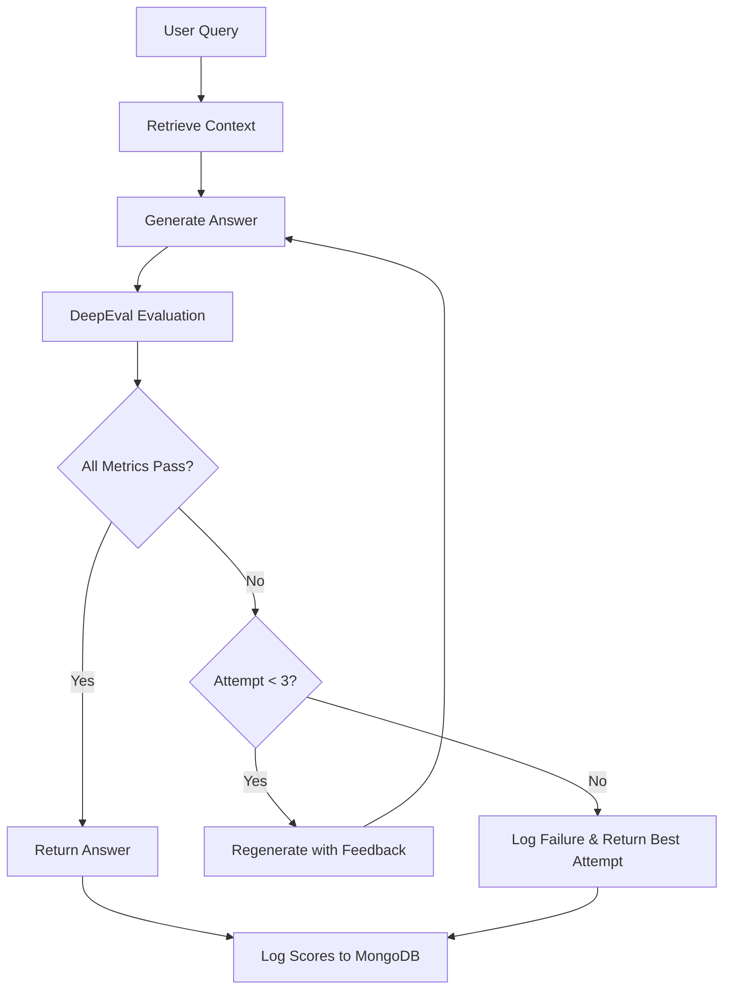

# DeepEval Evaluation Metrics - Legal Assistant

## Overview

This document defines the AI quality evaluation metrics using the **DeepEval framework** to ensure that the Legal Assistant produces reliable, accurate, and trustworthy legal information.

---

## 🎯 Evaluation Goals

1. **Ensure Factual Accuracy**: Answers must be grounded in retrieved legal sources
2. **Verify Relevance**: Answers must address the user's legal query
3. **Validate Context Quality**: Retrieved context must be accurate and complete
4. **Maintain Consistency**: Responses must be consistent across similar queries
5. **Enable Continuous Improvement**: Track quality metrics over time

---

## 📊 DeepEval Metrics

### **1. Faithfulness Metric**

**Purpose**: Verify that AI-generated answers are factually grounded in the retrieved legal sources.

**How It Works**:
- Compares the generated answer against the retrieved context (legal sections/judgments)
- Identifies claims in the answer
- Verifies each claim is supported by the context
- Penalizes hallucinations or unsupported statements

**Configuration**:
```python
from deepeval.metrics import FaithfulnessMetric

faithfulness_metric = FaithfulnessMetric(
    threshold=0.8,
    model="gpt-4",  # For evaluation
    include_reason=True
)
```

**Threshold**: ≥ 0.8 (80% of claims must be grounded)

**Example**:
```python
# Good (High Faithfulness)
Query: "What is the punishment for murder?"
Context: "Section 103 of BNS states: Murder shall be punished with death or life imprisonment"
Answer: "According to Section 103 of BNS, murder is punishable with death or life imprisonment"
Score: 1.0 ✅

# Bad (Low Faithfulness)
Query: "What is the punishment for murder?"
Context: "Section 103 of BNS states: Murder shall be punished with death or life imprisonment"
Answer: "Murder is punishable with 10 years imprisonment and a fine of Rs. 50,000"
Score: 0.0 ❌ (Hallucinated punishment)
```

---

### **2. Answer Relevancy Metric**

**Purpose**: Ensure the answer directly addresses the user's legal query.

**How It Works**:
- Analyzes semantic similarity between query and answer
- Checks if answer addresses the specific legal question asked
- Penalizes generic or off-topic responses

**Configuration**:
```python
from deepeval.metrics import AnswerRelevancyMetric

answer_relevancy_metric = AnswerRelevancyMetric(
    threshold=0.7,
    model="gpt-4",
    include_reason=True
)
```

**Threshold**: ≥ 0.7 (70% relevance to query)

**Example**:
```python
# Good (High Relevancy)
Query: "What is the punishment for attempt to murder?"
Answer: "According to Section 109 of BNS, attempt to murder is punishable with life imprisonment or imprisonment up to 10 years, plus fine"
Score: 0.95 ✅

# Bad (Low Relevancy)
Query: "What is the punishment for attempt to murder?"
Answer: "Murder is a serious crime under Indian law. The Bharatiya Nyaya Sanhita replaced the IPC in 2023"
Score: 0.3 ❌ (Doesn't answer the specific question)
```

---

### **3. Contextual Precision Metric**

**Purpose**: Validate that the retrieved context is accurate and relevant to the query.

**How It Works**:
- Evaluates the quality of retrieved chunks
- Checks if retrieved sections are relevant to the query
- Penalizes irrelevant or noisy context

**Configuration**:
```python
from deepeval.metrics import ContextualPrecisionMetric

contextual_precision_metric = ContextualPrecisionMetric(
    threshold=0.75,
    model="gpt-4",
    include_reason=True
)
```

**Threshold**: ≥ 0.75 (75% of context must be relevant)

**Example**:
```python
# Good (High Precision)
Query: "What is Section 138 of NI Act about?"
Retrieved Context: [
    "Section 138: Dishonour of cheque for insufficiency of funds...",
    "Section 141: Offences by companies..."
]
Score: 0.9 ✅ (Both sections relevant)

# Bad (Low Precision)
Query: "What is Section 138 of NI Act about?"
Retrieved Context: [
    "Section 138: Dishonour of cheque...",
    "Section 302 IPC: Murder...",
    "Contract Act Section 10..."
]
Score: 0.33 ❌ (Only 1/3 relevant)
```

---

### **4. Contextual Recall Metric**

**Purpose**: Ensure all relevant legal context is retrieved.

**How It Works**:
- Checks if all necessary legal sections are retrieved
- Verifies completeness of context
- Penalizes missing relevant information

**Configuration**:
```python
from deepeval.metrics import ContextualRecallMetric

contextual_recall_metric = ContextualRecallMetric(
    threshold=0.7,
    model="gpt-4",
    include_reason=True
)
```

**Threshold**: ≥ 0.7 (70% of relevant context retrieved)

**Example**:
```python
# Good (High Recall)
Query: "What are the provisions for cheque bouncing?"
Expected Context: ["Section 138", "Section 141", "Section 142"]
Retrieved Context: ["Section 138", "Section 141", "Section 142"]
Score: 1.0 ✅

# Bad (Low Recall)
Query: "What are the provisions for cheque bouncing?"
Expected Context: ["Section 138", "Section 141", "Section 142"]
Retrieved Context: ["Section 138"]
Score: 0.33 ❌ (Missing 2/3 relevant sections)
```

---

## 🔄 Evaluation Workflow



---

## 📈 Overall Quality Score

**Formula**:
```
Overall Quality Score = (
    Faithfulness * 0.35 +
    Answer Relevancy * 0.30 +
    Contextual Precision * 0.20 +
    Contextual Recall * 0.15
)
```

**Threshold**: ≥ 0.75 (75% overall quality)

**Weights Rationale**:
- **Faithfulness (35%)**: Most critical - prevents hallucinations
- **Answer Relevancy (30%)**: Ensures query is addressed
- **Contextual Precision (20%)**: Quality of retrieval
- **Contextual Recall (15%)**: Completeness of retrieval

---

## 🔁 Regeneration Logic

### **When to Regenerate**:
```python
if (
    faithfulness_score < 0.8 or
    answer_relevancy_score < 0.7 or
    contextual_precision_score < 0.75 or
    contextual_recall_score < 0.7 or
    overall_quality_score < 0.75
):
    trigger_regeneration()
```

### **Regeneration Strategy**:
1. **Attempt 1**: Use original context, regenerate with stricter prompt
2. **Attempt 2**: Re-retrieve context with modified query, regenerate
3. **Attempt 3**: Use expanded context (more chunks), regenerate
4. **After 3 attempts**: Return best attempt, log failure for review

### **Feedback Loop**:
```python
regeneration_prompt = f"""
Previous answer failed quality checks:
- Faithfulness: {faithfulness_score} (threshold: 0.8)
- Relevancy: {relevancy_score} (threshold: 0.7)

Issues identified:
{evaluation_reason}

Please regenerate ensuring:
1. All claims are grounded in provided context
2. Answer directly addresses the query
3. Use exact legal language from sources
"""
```

---

## 💾 Score Logging

### **MongoDB Schema**:
```json
{
  "_id": "eval_550e8400-e29b-41d4-a716-446655440000",
  "session_id": "chat_550e8400...",
  "query": "What is the punishment for murder?",
  "answer": "According to Section 103...",
  "context": ["Section 103 text..."],
  "evaluation": {
    "faithfulness": {
      "score": 0.95,
      "threshold": 0.8,
      "passed": true,
      "reason": "All claims grounded in Section 103"
    },
    "answer_relevancy": {
      "score": 0.88,
      "threshold": 0.7,
      "passed": true,
      "reason": "Directly answers punishment question"
    },
    "contextual_precision": {
      "score": 0.92,
      "threshold": 0.75,
      "passed": true,
      "reason": "Retrieved context highly relevant"
    },
    "contextual_recall": {
      "score": 0.85,
      "threshold": 0.7,
      "passed": true,
      "reason": "All necessary sections retrieved"
    },
    "overall_quality": {
      "score": 0.90,
      "threshold": 0.75,
      "passed": true
    }
  },
  "regeneration_attempts": 0,
  "timestamp": "2026-01-12T21:00:00Z",
  "feature": "chat"
}
```

---

## 📊 Monitoring & Reporting

### **Daily Metrics Dashboard**:
- Average scores per metric
- Pass/fail rates
- Regeneration frequency
- Feature-wise breakdown (Chat, Viability, Arguments, Clauses)

### **Weekly Reports**:
- Trend analysis
- Low-scoring queries (for improvement)
- Common failure patterns
- Recommendations for prompt/retrieval tuning

### **Alerts**:
- If daily pass rate < 90% → Alert QA team
- If regeneration rate > 20% → Alert AI team
- If faithfulness < 0.7 consistently → Critical alert

---

## 🎯 Feature-Specific Thresholds

### **Legal Chat**:
- Faithfulness: ≥ 0.8
- Answer Relevancy: ≥ 0.7
- Contextual Precision: ≥ 0.75
- Contextual Recall: ≥ 0.7

### **Viability Predictor**:
- Faithfulness: ≥ 0.85 (higher - critical for predictions)
- Answer Relevancy: ≥ 0.75
- Contextual Precision: ≥ 0.8 (must retrieve similar cases)
- Contextual Recall: ≥ 0.75

### **Argument Miner**:
- Faithfulness: ≥ 0.9 (highest - must be factual)
- Answer Relevancy: ≥ 0.8
- Contextual Precision: ≥ 0.85
- Contextual Recall: ≥ 0.8

### **Clause Search**:
- Faithfulness: ≥ 0.95 (exact quotes required)
- Answer Relevancy: ≥ 0.75
- Contextual Precision: ≥ 0.8
- Contextual Recall: ≥ 0.7

---

## 🔧 Implementation

### **Installation**:
```bash
pip install deepeval
```

### **Basic Usage**:
```python
from deepeval import evaluate
from deepeval.metrics import FaithfulnessMetric, AnswerRelevancyMetric
from deepeval.test_case import LLMTestCase

# Create test case
test_case = LLMTestCase(
    input="What is the punishment for murder?",
    actual_output="According to Section 103 of BNS, murder is punishable with death or life imprisonment",
    retrieval_context=["Section 103: Murder. Whoever commits murder shall be punished with death or imprisonment for life..."]
)

# Define metrics
metrics = [
    FaithfulnessMetric(threshold=0.8),
    AnswerRelevancyMetric(threshold=0.7)
]

# Evaluate
results = evaluate([test_case], metrics)
```

### **Integration with Chat API**:
```python
@app.post("/api/v1/chat")
async def chat(request: ChatRequest):
    # Generate answer
    answer, sources = await rag_chain.generate(request.query)
    
    # Evaluate
    evaluation_result = await evaluate_response(
        query=request.query,
        answer=answer,
        context=sources
    )
    
    # Regenerate if needed
    if not evaluation_result.passed:
        answer, sources = await regenerate_with_feedback(
            query=request.query,
            previous_answer=answer,
            evaluation_feedback=evaluation_result.reason
        )
    
    # Log scores
    await log_evaluation_scores(evaluation_result)
    
    return ChatResponse(answer=answer, sources=sources)
```

---

## 📚 References

- **DeepEval Documentation**: https://docs.confident-ai.com/
- **Metrics Guide**: https://docs.confident-ai.com/docs/metrics-introduction
- **Best Practices**: https://docs.confident-ai.com/docs/evaluation-best-practices

---

*This evaluation framework ensures that the Legal Assistant maintains high quality, factual accuracy, and reliability in all AI-generated legal responses.*
