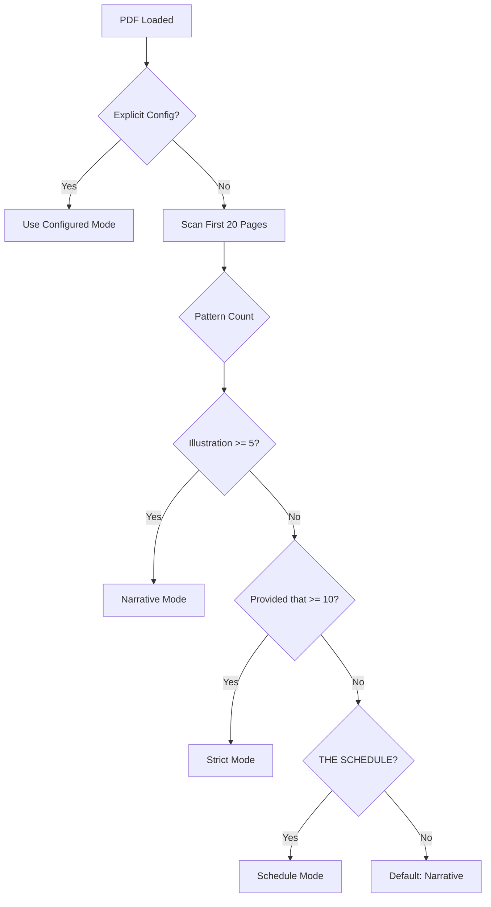
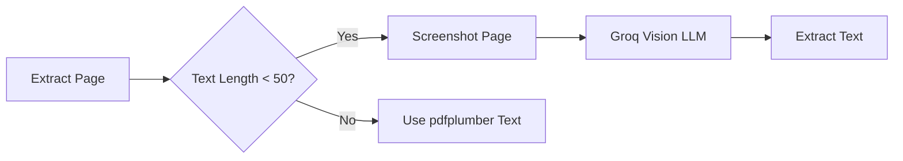
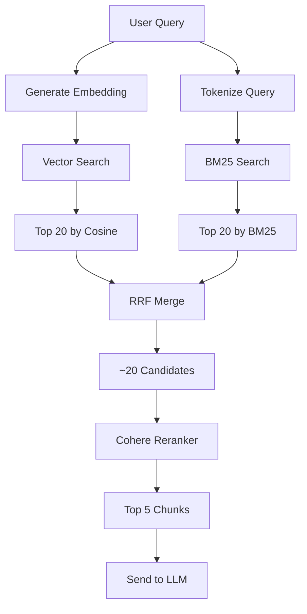
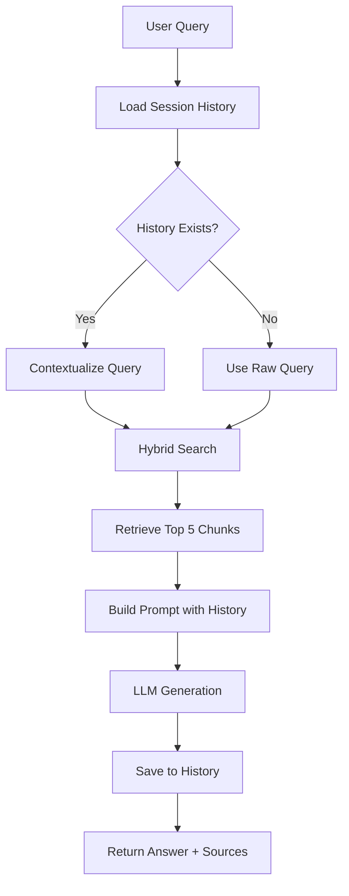
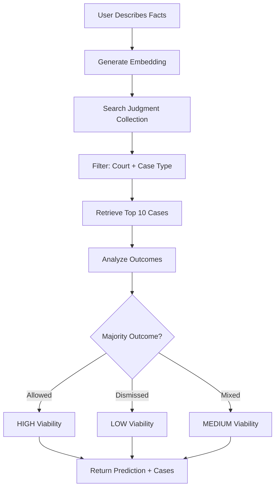
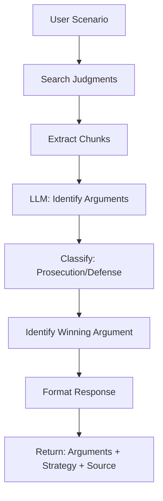
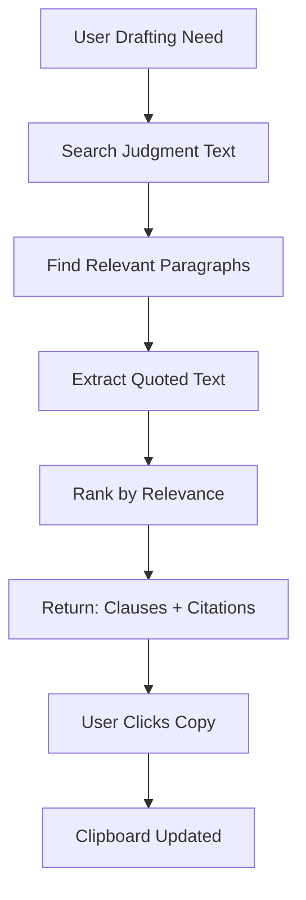

# Legal Assistant - System Architecture

## Executive Summary

The Legal Assistant is a production-grade AI-powered platform for Indian legal research, petition drafting, and case analysis. The system combines:

- **Smart PDF Parser** with multi-strategy parsing for legal documents
- **Hybrid Search Engine** (Vector + BM25) with Cohere reranking
- **RAG-based Chat** for natural language legal queries
- **Advanced Features**: Viability prediction, argument mining, and clause search
- **Dual Knowledge Base**: Statutory laws (Acts/Sections) + Judicial precedents (Judgments)

---

## System Architecture Overview

```mermaid
flowchart TB
    subgraph "Frontend Layer"
        UI[React UI - Vite + Material UI]
        UI_TABS[6 Tabs: Ingestion | Search | Chat | Viability | Arguments | Clauses]
    end
    
    subgraph "API Layer"
        API[FastAPI Backend]
        ROUTES[REST Endpoints]
        CORS[CORS Middleware]
    end
    
    subgraph "Core Services"
        PARSER[Smart PDF Parser]
        EMBED[Embedding Service]
        RETRIEVER[Hybrid Retriever]
        RERANK[Cohere Reranker]
        LLM[LLM Engine - Groq]
        MEMORY[Chat Memory]
    end
    
    subgraph "Data Layer"
        MONGO[(MongoDB Atlas)]
        VECTOR_IDX[Vector Index]
        TEXT_IDX[BM25 Index]
    end
    
    subgraph "External Services"
        GROQ[Groq API - LLM + Vision]
        MISTRAL[Mistral - Embeddings]
        COHERE[Cohere - Reranking]
    end
    
    UI --> API
    API --> PARSER
    API --> RETRIEVER
    API --> LLM
    PARSER --> EMBED
    EMBED --> MONGO
    RETRIEVER --> VECTOR_IDX
    RETRIEVER --> TEXT_IDX
    RETRIEVER --> RERANK
    RERANK --> LLM
    LLM --> MEMORY
    MEMORY --> MONGO
    
    EMBED -.-> MISTRAL
    LLM -.-> GROQ
    RERANK -.-> COHERE
    PARSER -.-> GROQ
    
    VECTOR_IDX -.-> MONGO
    TEXT_IDX -.-> MONGO
```

---

## Component Architecture

### 1. Frontend Layer

**Technology**: React 18 + Vite + Material UI

#### Components Structure

```
frontend/
├── src/
│   ├── App.jsx                    # Main layout with AppBar + Tabs
│   ├── components/
│   │   ├── FileUpload.jsx         # Drag-drop + progress polling
│   │   ├── SearchInterface.jsx    # Hybrid search UI
│   │   ├── ChatInterface.jsx      # RAG chat with source chips
│   │   ├── ViabilityPredictor.jsx # Case outcome prediction
│   │   ├── ArgumentMiner.jsx      # Extract legal arguments
│   │   └── ClauseSearch.jsx       # Drafting aid
│   ├── services/
│   │   └── api.js                 # Axios HTTP client
│   └── theme/
│       └── theme.js               # MUI theme (Enterprise Blue)
```

#### Key Features

| Tab | Primary Function | Backend Endpoint |
|-----|-----------------|------------------|
| **Ingestion** | Upload PDFs, track batch progress | `POST /api/v1/ingest` |
| **Search** | Direct hybrid search (no LLM) | `POST /api/v1/search` |
| **Chat** | Conversational legal Q&A | `POST /api/v1/chat` |
| **Viability** | Predict case outcome | `POST /api/v1/viability` |
| **Arguments** | Extract winning strategies | `POST /api/v1/arguments` |
| **Clauses** | Find petition language | `POST /api/v1/clauses` |

---

### 2. API Layer

**Technology**: FastAPI + Uvicorn

#### Endpoint Specification

```
app/api/
├── main.py           # FastAPI app initialization
├── routes.py         # All REST endpoints
└── middleware.py     # CORS, logging, error handling
```

#### REST API Endpoints

| Endpoint | Method | Purpose | Request | Response |
|----------|--------|---------|---------|----------|
| `/health` | GET | Health check | - | `{"status": "ok"}` |
| `/api/v1/ingest` | POST | Start batch ingestion | `files: List[UploadFile]` | `{"job_id": "uuid"}` |
| `/api/v1/ingest/status/{id}` | GET | Check progress | - | `{"current_file": "...", "progress": 45}` |
| `/api/v1/chat` | POST | RAG query | `{"session_id": "...", "query": "..."}` | `{"answer": "...", "sources": [...]}` |
| `/api/v1/search` | POST | Hybrid search | `{"query": "...", "filters": {...}}` | `{"results": [...], "total": 150}` |
| `/api/v1/autocomplete` | GET | Suggest sections | `?q=sec` | `["Section 302", ...]` |
| `/api/v1/viability` | POST | Predict outcome | `{"facts": "...", "filters": {...}}` | `{"prediction": "HIGH", "cases": [...]}` |
| `/api/v1/arguments` | POST | Extract arguments | `{"scenario": "..."}` | `{"prosecution": "...", "defense": "...", "winning": "..."}` |
| `/api/v1/clauses` | POST | Find clauses | `{"need": "..."}` | `{"clauses": [...]}` |

---

### 3. Smart PDF Parser

**Purpose**: Extract and structure legal documents with context-aware chunking

#### Architecture

```
app/parser/
├── manager.py              # Main orchestrator
├── strategies/
│   ├── narrative.py        # BNS, BSA, IPC (Illustrations)
│   ├── strict.py           # BNSS, Tax Acts (Provisos)
│   └── schedule.py         # PMLA, BNSS Schedules (Tables)
├── extractors/
│   ├── text_extractor.py   # pdfplumber
│   └── vision_extractor.py # Groq Vision for scanned PDFs
├── enrichers/
│   └── text_enricher.py    # Add context: [Act] > [Chapter] > [Section]
└── config/
    └── parser_modes.json   # Explicit mode mappings
```

#### Parsing Strategies

**1. Narrative Strategy** (BNS, BSA, IPC)
- **Pattern**: `^[0-9]+[A-Z]?\.` (Section detection)
- **Attachment**: `Illustration`, `Explanation` → Append to parent section
- **Use Case**: Acts with explanatory examples

**2. Strict Strategy** (BNSS, Income Tax)
- **Pattern**: `^[0-9]+[A-Z]?\.`
- **Attachment**: `Provided that` → Append to parent sub-section
- **Use Case**: Procedural acts with provisos

**3. Schedule Strategy** (PMLA, BNSS Schedules)
- **Trigger**: `THE SCHEDULE`
- **Parsing**: Row-by-row table extraction
- **Format**: `[Act] > Schedule I > [Offence] : Punishment is X, Y, Z`

#### Mode Detection Flow



#### OCR Fallback



---

### 4. Hybrid Retrieval Engine

**Purpose**: Combine semantic and keyword search with reranking

#### Architecture

```
app/services/
├── retriever.py          # Hybrid search orchestrator
├── vector_search.py      # MongoDB Atlas Vector Search
├── bm25_search.py        # MongoDB Atlas Text Search
├── rrf_merger.py         # Reciprocal Rank Fusion
└── reranker.py           # Cohere reranking
```

#### Retrieval Flow



#### RRF Formula

```
RRF_score(doc) = Σ [ 1 / (k + rank_i) ]

Where:
- k = 60 (constant)
- rank_i = rank in each retrieval method
- Weights: 0.6 (Vector) + 0.4 (BM25)
```

---

### 5. LLM Engine & Memory

**Technology**: LangChain + Groq (Llama-3.3-70b)

#### Architecture

```
app/services/
├── llm_engine.py              # LangChain setup
├── memory_manager.py          # MongoDB-backed memory
└── prompts/
    ├── chat_prompt.py         # RAG system prompt
    ├── viability_prompt.py    # Case prediction prompt
    ├── argument_prompt.py     # Argument extraction prompt
    └── clause_prompt.py       # Drafting aid prompt
```

#### Memory Strategy

**Type**: `ConversationSummaryBufferMemory`

| Strategy | Details |
|----------|---------|
| **Raw Storage** | Last 5 turns (10 messages) |
| **Summarization** | Older turns → Llama-3-8b summary |
| **Backend** | MongoDB `chat_history` collection |
| **Session ID** | UUID per user session |

#### Chat Flow with Memory



---

### 6. Data Layer

**Technology**: MongoDB Atlas

#### Collections

```
legal_db/
├── legal_chunks          # Acts/Sections (structured)
├── judgment_chunks       # Court judgments (chunked)
├── chat_history          # Conversation memory
└── ingestion_jobs        # Batch processing status
```

#### Schema: Legal Chunks

```json
{
  "_id": "BNS_Sec_103",
  "text_for_embedding": "[BNS] > Chapter VI > Section 103 - Murder : Whoever commits murder...",
  "raw_content": "103. Murder. Whoever commits murder shall be punished...",
  "embedding": [0.012, -0.234, ..., 0.987],
  "metadata": {
    "doc_type": "statute",
    "act_name": "Bharatiya Nyaya Sanhita, 2023",
    "category": "Criminal",
    "chapter": "VI - Of Offences Affecting Life",
    "section_id": "103",
    "chunk_type": "Section",
    "has_illustration": true,
    "has_proviso": false
  }
}
```

#### Schema: Judgment Chunks

```json
{
  "_id": "judgment_12345_chunk_3",
  "text_for_embedding": "Priti Bhojnagarwala vs State of Gujarat... The court held that...",
  "raw_content": "The court held that the wife, being a deemed director...",
  "embedding": [0.045, -0.123, ..., 0.876],
  "metadata": {
    "doc_type": "judgment",
    "title": "Priti Bhojnagarwala vs State Of Gujarat",
    "court": "Gujarat High Court",
    "case_type": "Criminal",
    "outcome": "Dismissed",
    "acts_cited": ["NI Act Section 138", "NI Act Section 141"],
    "chunk_index": 3,
    "total_chunks": 15,
    "doc_url": "https://indiankanoon.org/doc/1943657"
  }
}
```

#### MongoDB Indexes

**1. Vector Search Index**

```json
{
  "name": "vector_index",
  "type": "vectorSearch",
  "fields": [
    {
      "type": "vector",
      "path": "embedding",
      "numDimensions": 1024,
      "similarity": "cosine"
    },
    {
      "type": "filter",
      "path": "metadata.doc_type"
    },
    {
      "type": "filter",
      "path": "metadata.act_name"
    },
    {
      "type": "filter",
      "path": "metadata.category"
    }
  ]
}
```

**2. BM25 Text Index**

```json
{
  "name": "text_index",
  "type": "search",
  "mappings": {
    "dynamic": false,
    "fields": {
      "text_for_embedding": {
        "type": "string",
        "analyzer": "lucene.standard"
      },
      "raw_content": {
        "type": "string",
        "analyzer": "lucene.standard"
      }
    }
  }
}
```

---

## Advanced Features Architecture

### 1. Viability Predictor

**Goal**: Predict case outcome based on similar judgments



**Algorithm**:
```python
outcomes = [case.metadata.outcome for case in top_10_cases]
allowed_count = outcomes.count("Allowed")
dismissed_count = outcomes.count("Dismissed")

if allowed_count >= 7:
    prediction = "HIGH"
elif dismissed_count >= 7:
    prediction = "LOW"
else:
    prediction = "MEDIUM"
```

---

### 2. Argument Miner

**Goal**: Extract prosecution/defense arguments and identify winning strategy



**Prompt Template**:
```
Analyze the following judgment excerpt:

{judgment_text}

Extract:
1. Prosecution Arguments
2. Defense Arguments
3. Court's Ruling
4. Winning Strategy

Format as JSON.
```

---

### 3. Clause Search

**Goal**: Find exact legal phrasing for petition drafting



**Example Output**:
```
Clause: "The continuation of criminal proceedings would amount to 
abuse of process of law and court, and the trial would be futile, 
as the dispute is overwhelmingly civil in nature and has been resolved."

Source: Rabari Sagarbhai vs State of Gujarat, Gujarat HC
Citation: Citing Gian Singh vs State of Punjab
```

---

## Technology Stack

### Backend

| Component | Technology | Version | Purpose |
|-----------|-----------|---------|---------|
| **Framework** | FastAPI | 0.104+ | REST API |
| **Server** | Uvicorn | 0.24+ | ASGI server |
| **Database** | MongoDB Atlas | 7.0+ | Vector + Document DB |
| **DB Driver** | Motor | 3.3+ | Async MongoDB |
| **LLM** | Groq (Llama-3.3-70b) | - | Chat generation |
| **Embeddings** | Mistral (mistral-embed) | - | Vector embeddings |
| **Reranking** | Cohere (rerank-v3.0) | - | Result refinement |
| **Vision** | Groq (Llama-3.2-Vision) | - | OCR for scanned PDFs |
| **PDF Parsing** | pdfplumber | 0.10+ | Text extraction |
| **LangChain** | LangChain | 0.1+ | RAG orchestration |

### Frontend

| Component | Technology | Version | Purpose |
|-----------|-----------|---------|---------|
| **Framework** | React | 18+ | UI framework |
| **Build Tool** | Vite | 5+ | Fast dev server |
| **UI Library** | Material UI | 5+ | Component library |
| **HTTP Client** | Axios | 1.6+ | API calls |
| **State** | React Hooks | - | Local state |

### DevOps

| Component | Technology | Purpose |
|-----------|-----------|---------|
| **Environment** | python-dotenv | Config management |
| **Logging** | Python logging | Structured logs |
| **Testing** | pytest | Unit/integration tests |
| **Linting** | ruff | Code quality |

---

## Environment Configuration

### Required API Keys

```bash
# LLM
LLM_PROVIDER=groq
LLM_API_KEY=gsk_...
LLM_MODEL=llama-3.3-70b-versatile

# Embeddings
EMBED_PROVIDER=mistral
EMBED_API_KEY=...
EMBED_MODEL_NAME=mistral-embed

# Reranking
RERANK_PROVIDER=cohere
RERANK_API_KEY=...
RERANK_MODEL_NAME=rerank-english-v3.0

# Vision (OCR)
VISION_PROVIDER=groq
VISION_API_KEY=gsk_...
VISION_MODEL_NAME=llama-3.2-11b-vision-preview

# MongoDB
MONGO_URI=mongodb+srv://...
MONGO_DB=legal_db
MONGO_COLLECTION=legal_chunks
```

### Configurable Parameters

```bash
# Search
VECTOR_SEARCH_TOP_K=20
BM25_TOP_K=20
HYBRID_VECTOR_WEIGHT=0.6
HYBRID_BM25_WEIGHT=0.4
RERANK_TOP_K=5

# LLM
LLM_TEMPERATURE=0.0
LLM_MAX_TOKENS=2000

# Memory
CHATBOT_MAX_HISTORY=10

# Ingestion
BATCH_SIZE=10
MAX_RETRIES=3
DOC_MIN_CHARS_FOR_OCR=50
```

---

## Implementation Roadmap

### Phase 1: Core Infrastructure (Weeks 1-2)

- [ ] Set up MongoDB Atlas with indexes
- [ ] Implement Smart PDF Parser (3 strategies)
- [ ] Build embedding service (Mistral)
- [ ] Create basic FastAPI endpoints
- [ ] Implement hybrid search (Vector + BM25)

### Phase 2: RAG Chat (Week 3)

- [ ] Integrate LangChain with Groq
- [ ] Implement MongoDB-backed memory
- [ ] Build chat API endpoint
- [ ] Create React chat UI
- [ ] Add source citation chips

### Phase 3: Search & Ingestion UI (Week 4)

- [ ] Build file upload component
- [ ] Implement batch ingestion with progress
- [ ] Create search interface
- [ ] Add autocomplete
- [ ] Implement pagination

### Phase 4: Advanced Features (Weeks 5-6)

- [ ] Viability Predictor
  - [ ] Judgment ingestion pipeline
  - [ ] Outcome extraction (regex + LLM)
  - [ ] Prediction algorithm
  - [ ] UI component
- [ ] Argument Miner
  - [ ] Argument extraction prompt
  - [ ] Classification logic
  - [ ] UI component
- [ ] Clause Search
  - [ ] Exact text retrieval
  - [ ] Copy-to-clipboard
  - [ ] UI component

### Phase 5: Testing & Optimization (Week 7)

- [ ] Unit tests for parser
- [ ] Integration tests for API
- [ ] End-to-end UI tests
- [ ] Performance optimization
- [ ] Security audit

### Phase 6: Deployment (Week 8)

- [ ] Production environment setup
- [ ] CI/CD pipeline
- [ ] Monitoring & logging
- [ ] Documentation
- [ ] User training

---

## Key Design Decisions

### 1. Single vs. Dual Collection Strategy

**Decision**: **Dual Collections** (Acts + Judgments)

**Rationale**:
- Different schemas (Acts have `section_id`, Judgments have `outcome`)
- Different chunking strategies (section-based vs. paragraph-based)
- Easier to maintain type-specific indexes
- Queries can target specific collection when needed

**Trade-off**: Cross-collection search requires two queries + merge

---

### 2. Judgment Chunking Strategy

**Decision**: **Recursive Splitter with Large Overlap (200 tokens)**

**Rationale**:
- Preserves context across chunks
- Keeps arguments + rulings together
- Works well with LangChain
- Balances chunk size vs. retrieval quality

**Configuration**:
```python
chunk_size = 1000 characters
chunk_overlap = 200 characters
```

---

### 3. Outcome Extraction

**Decision**: **Regex for POC, LLM for Production**

**Rationale**:
- Regex is fast and cheap for initial testing
- LLM provides ~95% accuracy for edge cases
- Hybrid approach: Regex first, LLM fallback

**Regex Patterns**:
```python
outcomes = [
    r"petition.*?allowed",
    r"petition.*?dismissed",
    r"FIR.*?quashed",
    r"conviction.*?set aside"
]
```

---

## Security Considerations

### API Security

- [ ] Rate limiting (100 req/min per IP)
- [ ] API key authentication for production
- [ ] Input validation (Pydantic models)
- [ ] SQL injection prevention (MongoDB parameterized queries)

### Data Privacy

- [ ] No PII in logs
- [ ] Session data encryption
- [ ] GDPR-compliant data retention (30 days)

### Infrastructure

- [ ] MongoDB Atlas IP whitelist
- [ ] HTTPS only (TLS 1.3)
- [ ] Environment variables for secrets
- [ ] Regular dependency updates

---

## Monitoring & Observability

### Metrics to Track

| Metric | Tool | Threshold |
|--------|------|-----------|
| API Latency | FastAPI middleware | < 500ms (p95) |
| Search Accuracy | Manual review | > 90% |
| LLM Token Usage | Groq dashboard | < 1M tokens/day |
| Embedding Cost | Mistral dashboard | < $50/month |
| MongoDB Queries | Atlas metrics | < 100ms (p95) |

### Logging Strategy

```python
import logging

logger.info("User query", extra={
    "session_id": session_id,
    "query_length": len(query),
    "retrieval_time_ms": retrieval_time,
    "llm_time_ms": llm_time
})
```

---

## Open Questions for Team Discussion

> [!WARNING]
> These decisions require team input before implementation.

### Q1: Judgment Data Source

**Options**:
- **Option A**: HuggingFace dataset (10K judgments, ready to use)
- **Option B**: Indian Kanoon scraping (millions of judgments, requires scraper)

**Recommendation**: Start with Option A for POC, scale to Option B for production.

---

### Q2: Deployment Strategy

**Options**:
- **Option A**: Serverless (AWS Lambda + API Gateway)
- **Option B**: Container-based (Docker + ECS/GKE)
- **Option C**: VM-based (EC2/Compute Engine)

**Recommendation**: Option B (Docker) for flexibility and cost control.

---

### Q3: User Authentication

**Options**:
- **Option A**: No auth (POC only)
- **Option B**: Simple API keys
- **Option C**: OAuth 2.0 (Google/Microsoft)

**Recommendation**: Option A for POC, Option C for production.

---

## Next Steps

1. **Review this architecture** with the team
2. **Answer open questions** (Q1-Q3 above)
3. **Set up development environment** (MongoDB Atlas, API keys)
4. **Create implementation plan** with detailed task breakdown
5. **Begin Phase 1** (Core Infrastructure)

---

## References

- [MongoDB Atlas Vector Search Docs](https://www.mongodb.com/docs/atlas/atlas-vector-search/)
- [LangChain RAG Tutorial](https://python.langchain.com/docs/use_cases/question_answering/)
- [Groq API Documentation](https://console.groq.com/docs)
- [Cohere Rerank API](https://docs.cohere.com/reference/rerank)
- [FastAPI Best Practices](https://fastapi.tiangolo.com/tutorial/)
