# Legal Assistant - Implementation Plan

A production-grade AI assistant for Indian Laws, featuring a "Smart Parser" for legal documents, Hybrid Search with Reranking, and a React-based UI.

## Prerequisites & Dependencies

> [!IMPORTANT]
> **External Services Required**: Ensure all API keys are configured in `.env` before running.

| Service | Purpose | Provider |
| :--- | :--- | :--- |
| **LLM** | Chat generation | Groq (Llama-3.3-70b) |
| **Embeddings** | Vector search | Mistral (mistral-embed) |
| **Vector DB** | Storage & search | MongoDB Atlas |
| **Reranking** | Result refinement | Cohere |
| **Vision OCR** | Scanned PDF fallback | Groq (Llama-3.2-Vision) |

> [!TIP]
> All providers are **configurable via `.env`**. You can swap Groq for OpenAI, Mistral for OpenAI embeddings, etc.

### PDF Parsing Strategy

| Step | Condition | Action |
| :---: | :--- | :--- |
| 1 | Text-selectable PDF | Extract via `pdfplumber` |
| 2 | Page has < 50 characters | Screenshot → Vision LLM → Extract text |

> [!NOTE]
> **Deferred Features**: IPC ↔ BNS Bridge Logic (mapping old to new criminal codes) is out of scope for v1.

---

## Open Questions (Team Discussion Required)

> [!WARNING]
> The following design decisions need team input before implementation.

### Q1: MongoDB Collection Strategy

**Problem**: We have two different document types with different schemas:
- **Acts/Sections**: `section_id`, `chapter`, `has_illustration`, etc.
- **Judgments**: `Titles`, `Court_Name`, `Cites`, `Cited_by`, `Outcome`, etc.

| Option | Pros | Cons |
| :--- | :--- | :--- |
| **Option A: Single Collection** | Simpler queries, unified search | Schema complexity, sparse fields |
| **Option B: Two Collections** | Clean schemas, type-specific indexes | Cross-collection search complexity |

**Recommendation**: _TBD by team_

---

### Q2: Judgment Chunking Strategy

**Problem**: Judgment texts are very large (50k-100k+ characters). We cannot:
- Store entire text as single chunk (embedding quality degrades)
- Send entire judgment to LLM (token limits, cost)

| Strategy | Description | Chunk Size | Overlap |
| :--- | :--- | :--- | :--- |
| **Paragraph-based** | Split by `\n\n` (paragraph breaks) | Variable | 0 |
| **Fixed Token** | Split every N tokens | 500 tokens | 100 tokens |
| **Semantic Sections** | Split by legal structure (Facts, Arguments, Ruling) | Variable | 50 tokens |
| **Recursive Splitter** | LangChain RecursiveCharacterSplitter | 1000 chars | 200 chars |

**Key Considerations**:
- For **Argument Miner**: Need arguments + ruling in same chunk
- For **Clause Search**: Need exact quoted text + context
- For **Viability**: Need outcome + key facts together

**Recommendation**: Recursive Splitter with **large overlap (200 tokens)** to preserve context.

---

### Q3: Judgment Metadata Extraction

**Problem**: The `Outcome` field is not in the source JSON - it's buried in the text.

| Approach | Description | Accuracy |
| :--- | :--- | :--- |
| **Regex** | Search last 500 chars for "Dismissed", "Allowed", etc. | ~80% |
| **LLM Extraction** | Send last 1000 chars to LLM, ask for outcome | ~95% |
| **Manual Labeling** | Human review for POC dataset | 100% |

**Recommendation**: Start with **Regex** for POC, upgrade to LLM later.

---

## Data Sources

### Primary Sources

| Act | Replaces | Source | Parser Mode |
| :--- | :--- | :--- | :--- |
| **BNS** (Act 45/2023) | IPC, 1860 | [MHA PDF](https://www.mha.gov.in/sites/default/files/250883_english_01042024.pdf) | **Narrative** (Illustrations) |
| **BNSS** (Act 46/2023) | CrPC, 1973 | [MHA Gazette](https://egazette.gov.in/) / [India Code](https://www.indiacode.nic.in/) | **Strict** + **Schedule** |
| **BSA** (Act 47/2023) | Evidence Act, 1872 | [MHA Gazette](https://egazette.gov.in/) / [India Code](https://www.indiacode.nic.in/) | **Narrative** |

### Additional Sources

| Source | URL | Content |
| :--- | :--- | :--- |
| **India Code** | [indiacode.nic.in](https://www.indiacode.nic.in/) | All Central & State Acts |
| **MHA Website** | [mha.gov.in](https://www.mha.gov.in/) | New Criminal Laws Gazette PDFs |

### Judgments Data Source (NEW)

| Phase | Source | Format | Volume |
| :--- | :--- | :--- | :--- |
| **POC** | [HuggingFace - InJudgements](https://huggingface.co/datasets/opennyaiorg/InJudgements_dataset) | Parquet → JSON | 10,000 judgments |
| **Production** | [Indian Kanoon](https://indiankanoon.org/browse/) | Web Scraping | All judgments |

#### Judgment JSON Schema

```json
{
  "Titles": "Priti Bhojnagarwala vs State Of Gujarat on 4 May, 2001",
  "Court_Name": "Gujarat High Court",
  "Cites": 72,
  "Cited_by": 2,
  "Doc_url": "https://indiankanoon.org/doc/1943657",
  "Text": "JUDGMENT H.H. Mehta, J. ...",
  "Doc_size": 75823,
  "Case_Type": "Criminal",
  "Court_Type": "High_Court",
  "Court_Name_Normalized": "Gujarat High Court"
}
```

#### Pre-processing Requirements

| Step | Action | Purpose |
| :---: | :--- | :--- |
| 1 | Extract `Outcome` from last 500 chars | Classify: Allowed/Dismissed/Acquitted/Quashed |
| 2 | Chunk with large overlap (200 tokens) | Keep arguments + judge's ruling together |
| 3 | Extract `Acts_Cited` via regex | Link judgments to Acts (IPC 302, BNS 103, etc.) |

## Application Features

### UI Tabs & Features

| Tab | Feature | Description |
| :--- | :--- | :--- |
| **Document Ingestion** | CLI Batch Ingest | `python scripts/ingest_batch.py --folder ./pdfs/` |
| | UI Upload | Drag & Drop PDFs in browser |
| | Real-time Progress | Live status (current file, % complete) |
| | Retry on Failure | Auto-retry with exponential backoff |
| **Search** | Keyword/Semantic Search | Hybrid search without LLM |
| | Autocomplete | Suggest act names/sections as you type |
| | Filter by Act/Category | Dropdown filters |
| | View Full Section | Click result to see raw text |
| | Cross-References | Show related sections from other acts |
| | Pagination | Navigate through results |
| **Legal Chat** | Natural Language Query | Ask questions in English/Hindi |
| | Source Citations | Clickable chips [Act, Section X] |
| | Conversation Memory | Context across turns |
| | New Chat | Clear history |
| **Viability Predictor** | Case Outcome Prediction | Predict: Allowed/Dismissed/Quashed |
| | Confidence Score | Show likelihood (High/Medium/Low) |
| | Supporting Cases | List similar past judgments |
| | Filters | Court, Case Type, Year |
| **Argument Miner** | Extract Arguments | Prosecution vs Defense arguments |
| | Winning Argument | Highlight successful strategy |
| | Case Context | Show relevant judgment excerpts |
| | Copy to Clipboard | Quick copy for drafting |
| **Clause Search** | Legal Phrasing Search | Find exact petition language |
| | Quoted Text | Exact quotes with source |
| | Multiple Suggestions | Show alternative phrasings |
| | Copy Button | One-click copy |

---

## Judgment POC Use Cases

### POC 1: Viability Predictor ("Can I Win?")

**Goal**: Predict if a petition will be Allowed or Dismissed based on past judgments.

| User Query | RAG Retrieval | AI Analysis | Bot Response |
| :--- | :--- | :--- | :--- |
| "I am the wife of the owner. I didn't sign the cheque. Can I quash the case?" | Priti Bhojnagarwala vs State of Gujarat | Wife = deemed director, association of individuals | **Low Viability**. Court held wife liable even without signing. |
| "We settled the cheating case amicably. Can we close the FIR?" | Rabari Sagarbhai case | Private dispute, settled amicably | **High Viability**. Court quashed FIR as continuation was abuse of process. |

### POC 2: Argument Miner ("What Should I Say?")

**Goal**: Extract winning legal arguments from past judgments.

**Example**: Murder vs Culpable Homicide

| User Query | "My client hit victim once on head. He died. How to avoid S.302 (Murder)?" |
| :--- | :--- |
| **RAG Retrieval** | State vs Sonu (Gujarat HC) |
| **Prosecution Argument** | Injury on vital part (head), brain matter visible |
| **Defense Argument (Winning)** | Solitary blow, victim sleeping, no repeated attack |
| **Court Ruling** | Converted S.302 (Murder) → S.304 (Culpable Homicide) |
| **Bot Response** | "Argue: *Single blow with no intent to kill*. Cite State vs Sonu." |

### POC 3: Clause Search (Drafting Aid)

**Goal**: Find exact legal phrasing for petition drafts.

| User Query | "Draft prayer clause for quashing FIR based on settlement" |
| :--- | :--- |
| **RAG Retrieval** | Rabari Sagarbhai, citing Gian Singh vs State |
| **Extracted Clause** | "The continuation of criminal proceedings would amount to abuse of process of law and court, and the trial would be futile, as the dispute is overwhelmingly civil in nature and has been resolved." |

---

## UI Prototypes

### 1. Document Ingestion Tab

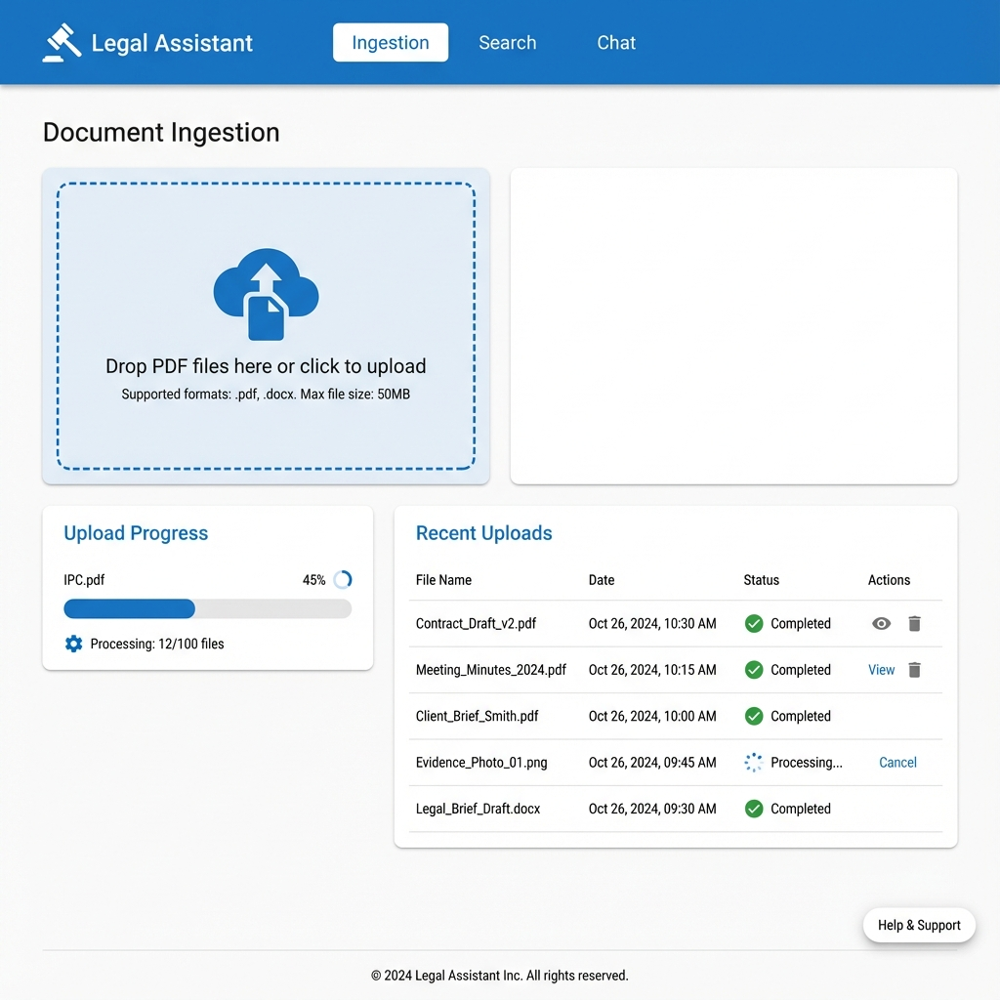

### 2. Search Tab


### 3. Legal Chat Tab

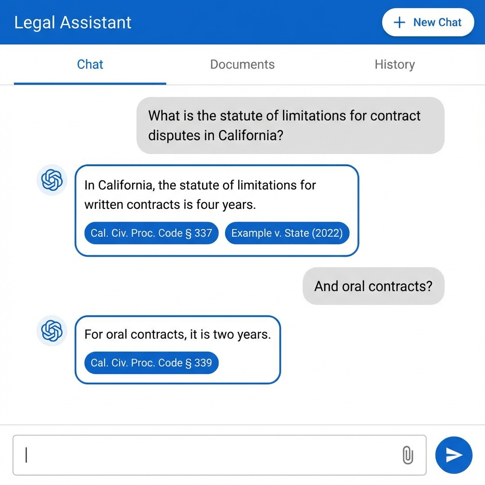

### 4. Viability Predictor Tab

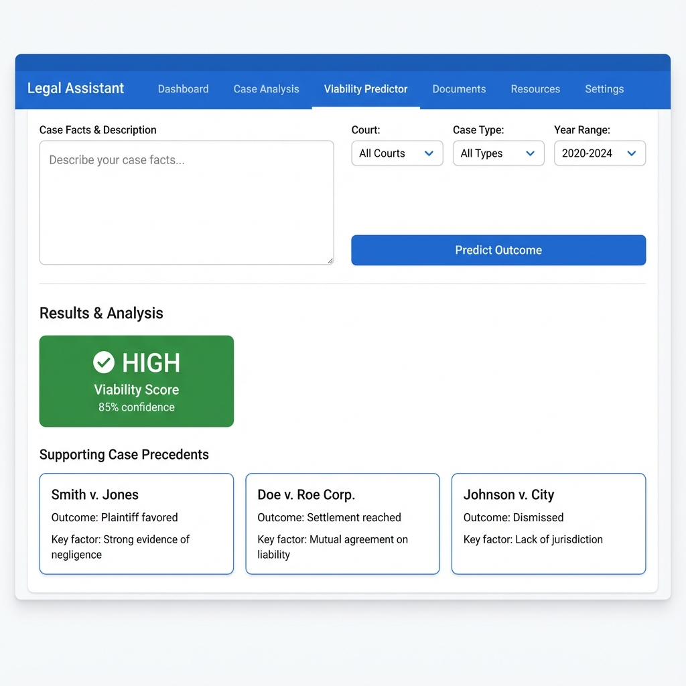

### 5. Argument Miner Tab

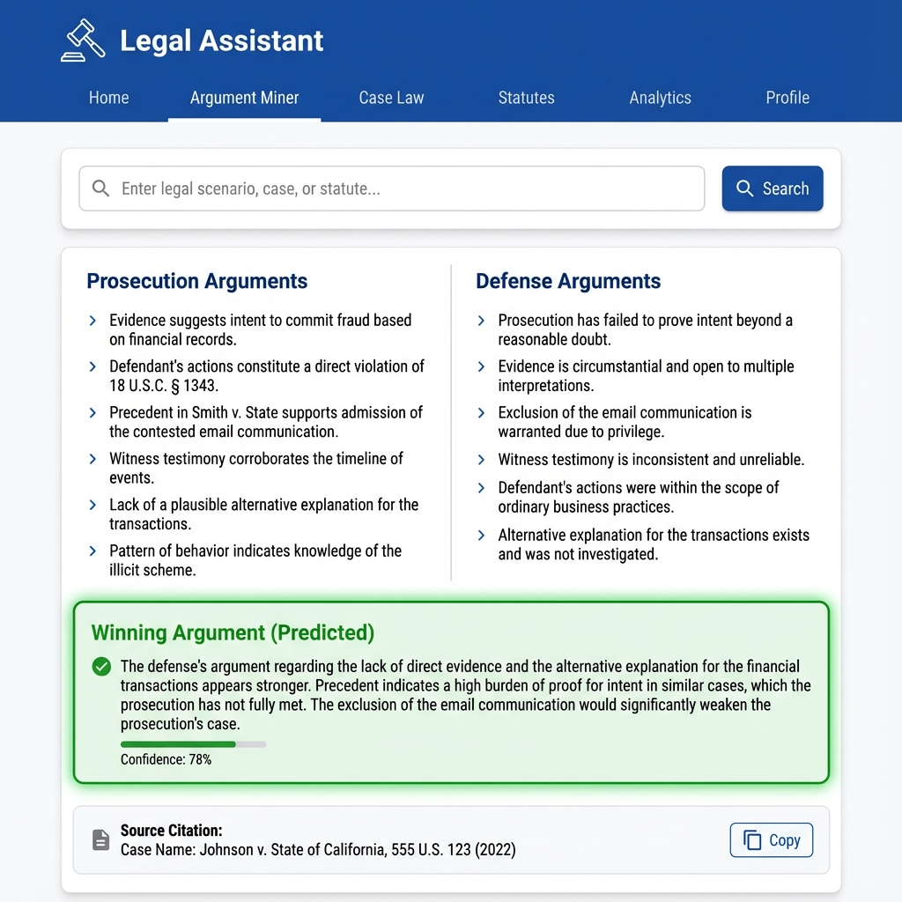

### 6. Clause Search Tab

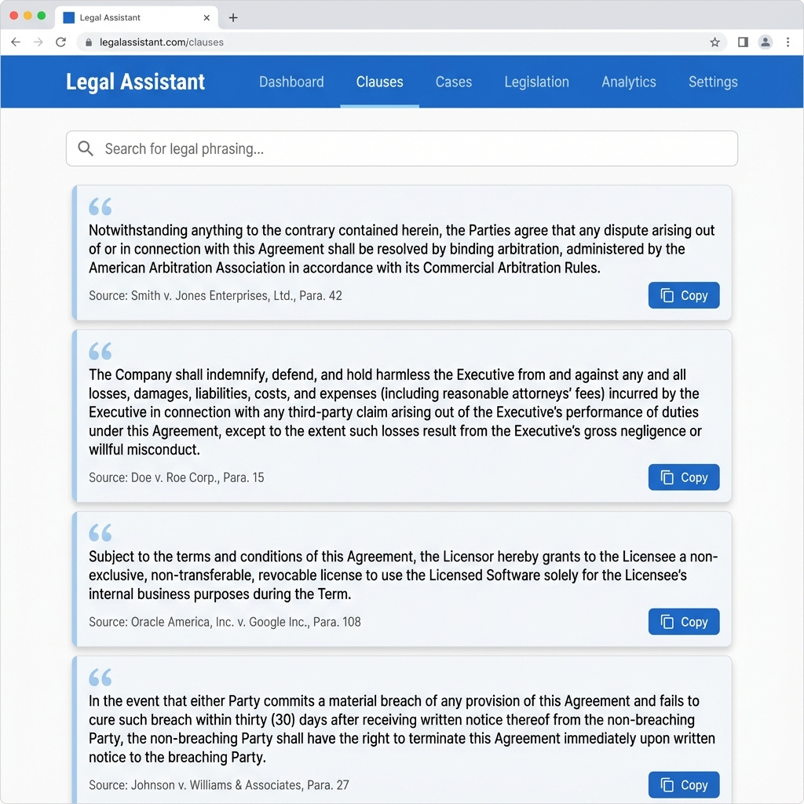

---

## Internal Flow Diagrams

### 1. Document Ingestion Flow

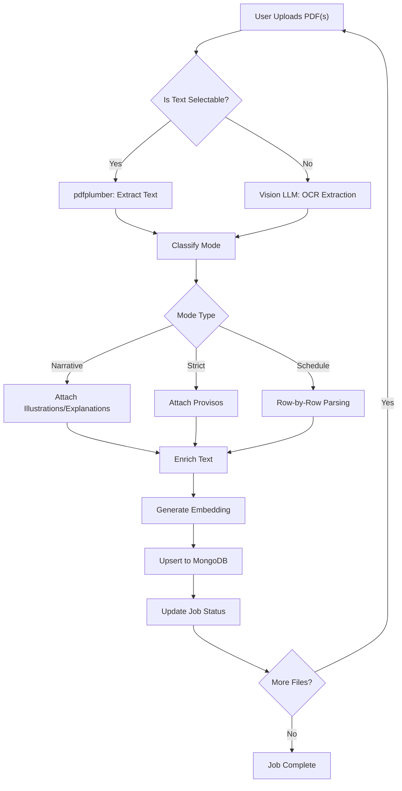

### 2. Chat Query Flow

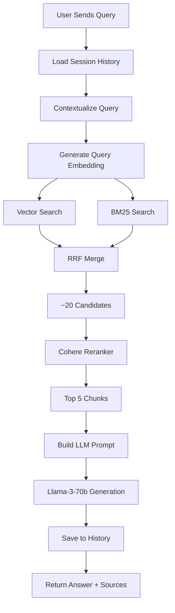

### 3. Hybrid Search Detail

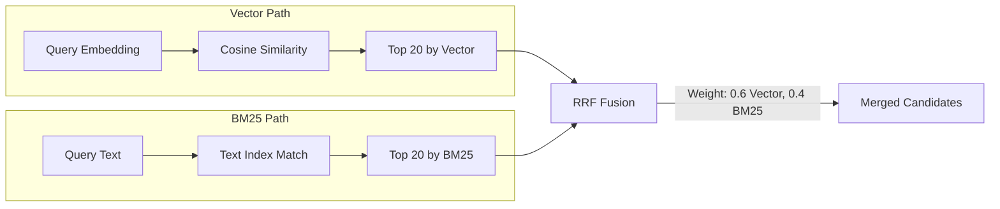

### 4. Search Feature Flow (No LLM)

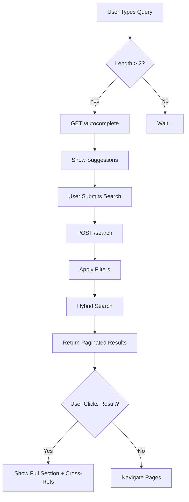

### 5. Viability Predictor Flow

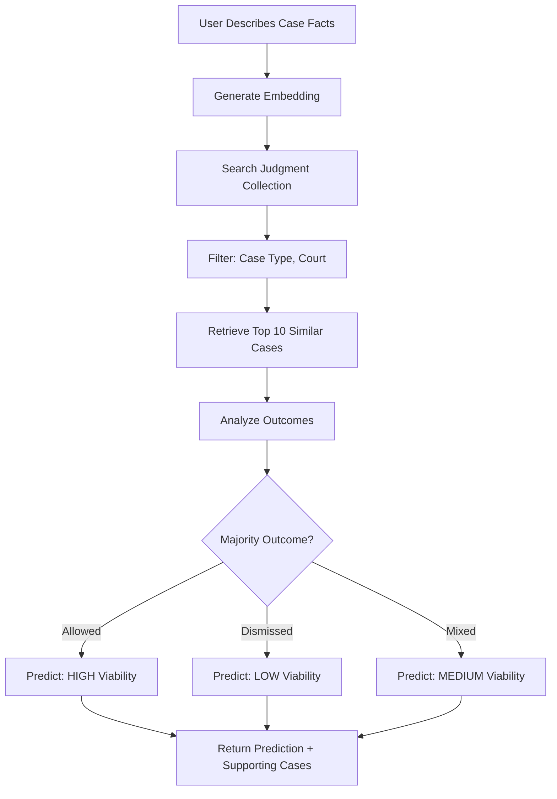

### 6. Argument Miner Flow

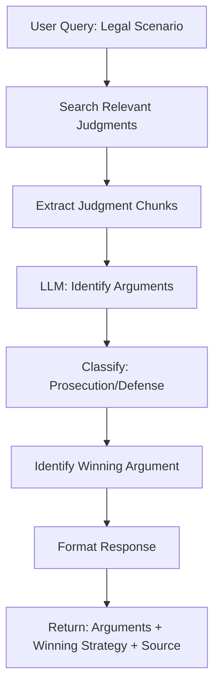

### 7. Clause Search Flow

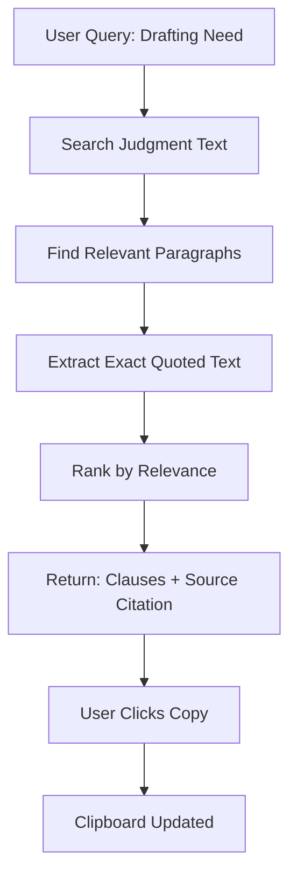

## Proposed Changes

### Project Structure & Configuration

#### [NEW] [Project Root]
- `.env.example`: Template for environment variables.
- `requirements.txt`: Python dependencies.
- `app/`: Main backend application directory.

### Environment Configuration Specification

The system relies on the following `.env` variables:

| Category | Variable Name | Description | Default |
| :--- | :--- | :--- | :--- |
| **Server** | `API_HOST` | Bind address | `0.0.0.0` |
| | `API_PORT` | Port number | `8000` |
| | `DEBUG` | Enable debug mode | `false` |
| | `LOG_LEVEL` | Logging verbosity | `INFO` |
| | `ALLOWED_ORIGINS` | CORS origins (JSON list) | `["http://localhost:5173"]` |
| **MongoDB** | `MONGO_URI` | Atlas Connection String | - |
| | `MONGO_DB` | Database Name | `legal_db` |
| | `MONGO_COLLECTION` | Chunks Collection | `legal_chunks` |
| **Embedding** | `EMBED_PROVIDER` | Provider (mistral/openai) | `mistral` |
| | `EMBED_MODEL_NAME` | Model Name | `mistral-embed` |
| | `EMBED_API_KEY` | API Key | - |
| | `EMBED_API_URL` | API Endpoint | `https://api.mistral.ai/v1/embeddings` |
| | `EMBED_RETRY_COUNT` | Retries on failure | `3` |
| **Vector Search** | `VECTOR_SEARCH_INDEX_NAME` | Atlas Index Name | `vector_index` |
| | `VECTOR_SEARCH_TOP_K` | Initial candidates | `20` |
| | `VECTOR_SEARCH_MIN_SCORE` | Minimum similarity | `0.5` |
| **BM25 Search** | `BM25_TEXT_INDEX_NAME` | Atlas Text Index Name | `text_index` |
| | `BM25_TOP_K` | Initial candidates | `20` |
| | `BM25_MIN_SCORE` | Minimum score | `0.5` |
| **Hybrid Search** | `HYBRID_VECTOR_WEIGHT` | Vector contribution | `0.6` |
| | `HYBRID_BM25_WEIGHT` | BM25 contribution | `0.4` |
| | `HYBRID_TOP_K` | Combined candidates | `20` |
| | `HYBRID_MIN_SCORE` | Final threshold | `0.7` |
| | `HYBRID_NORMALIZATION_METHOD` | Score normalization | `minmax` |
| **Reranking** | `RERANK_PROVIDER` | Provider (cohere/groq) | `cohere` |
| | `RERANK_MODEL_NAME` | Model Name | `rerank-english-v3.0` |
| | `RERANK_API_KEY` | API Key | - |
| | `RERANK_TOP_K` | Final chunks to LLM | `5` |
| **LLM (Chat)** | `LLM_PROVIDER` | Provider (groq/openai) | `groq` |
| | `LLM_MODEL` | Model Name | `llama-3.3-70b-versatile` |
| | `LLM_API_KEY` | API Key | - |
| | `LLM_API_URL` | API Endpoint | `https://api.groq.com/openai/v1/chat/completions` |
| | `LLM_TEMPERATURE` | Creativity (0.0-1.0) | `0.0` |
| | `LLM_MAX_TOKENS` | Max response tokens | `2000` |
| **Vision (OCR)** | `VISION_PROVIDER` | Provider (groq/openrouter) | `groq` |
| | `VISION_MODEL_NAME` | Vision Model | `llama-3.2-11b-vision-preview` |
| | `VISION_API_KEY` | API Key | - |
| | `VISION_API_URL` | API Endpoint | - |
| **Document Processing** | `DOC_MAX_FILE_SIZE` | Max upload size (bytes) | `10485760` |
| | `DOC_ALLOWED_EXTENSIONS` | Allowed file types | `pdf` |
| | `DOC_MIN_CHARS_FOR_OCR` | Char threshold to trigger Vision | `50` |
| **Ingestion** | `BATCH_SIZE` | Files processed at once | `10` |
| | `MAX_RETRIES` | Retries for failed files | `3` |
| | `RETRY_DELAY` | Seconds between retries | `2` |
| **Chatbot Memory** | `CHATBOT_MAX_HISTORY` | Raw turns to keep | `10` |
| | `CHATBOT_MEMORY_TYPE` | Memory strategy | `buffer` |
| **Chatbot UI** | `CHATBOT_SHOW_SOURCES` | Display source chips | `true` |
| | `CHATBOT_SHOW_SCORES` | Display relevance scores | `false` |

### Core Parser (The "Smart Parser")

#### `manager` - Main Orchestrator

```
ALGORITHM: ProcessPDF(file_path)

  INPUT:  file_path (string)
  OUTPUT: List of LegalChunk objects

  1. pages ← ExtractTextFromPDF(file_path)
  
  2. FOR EACH page IN pages:
       IF Length(page.text) < DOC_MIN_CHARS_FOR_OCR THEN
         page.text ← VisionLLM_ExtractText(page.image)
       END IF
     END FOR
  
  3. mode ← GetModeFromConfig(file_path)
     IF mode IS NULL THEN
       mode ← DetectModeFromContent(pages[0..20])
     END IF
  
  4. strategy ← SelectStrategy(mode)  // Narrative, Strict, or Schedule
  
  5. chunks ← strategy.Parse(pages)
  
  6. FOR EACH chunk IN chunks:
       EnrichChunk(chunk)  // Prepend [Act] > [Chapter] > [Section]
     END FOR
  
  7. RETURN chunks
END ALGORITHM
```

---

#### `NarrativeStrategy` (BNS, BSA, IPC, Contract Act)

```
ALGORITHM: NarrativeStrategy.Parse(pages)

  INPUT:  pages (list of page objects)
  OUTPUT: List of Chunk objects
  
  CONSTANTS:
    SECTION_PATTERN = "^[0-9]+[A-Z]?\."   // e.g., "3.", "302.", "44AD."
    ATTACH_KEYWORDS = ["Illustration", "Explanation"]

  1. chunks ← empty list
  2. current_chunk ← NULL
  
  3. FOR EACH line IN AllLines(pages):
  
       CASE 1: line MATCHES SECTION_PATTERN
         IF current_chunk IS NOT NULL THEN
           Append(chunks, current_chunk)
         END IF
         current_chunk ← NewChunk(line)
       
       CASE 2: line STARTS WITH any of ATTACH_KEYWORDS
         // ATTACH to previous section, do NOT create new chunk
         current_chunk.content ← current_chunk.content + "\n" + line
         current_chunk.has_illustration ← TRUE
       
       DEFAULT:
         current_chunk.content ← current_chunk.content + "\n" + line
       
     END FOR
  
  4. IF current_chunk IS NOT NULL THEN
       Append(chunks, current_chunk)
     END IF
  
  5. RETURN chunks
END ALGORITHM
```

---

#### `StrictStrategy` (BNSS, Income Tax, GST)

```
ALGORITHM: StrictStrategy.Parse(pages)

  INPUT:  pages
  OUTPUT: List of Chunk objects
  
  CONSTANTS:
    SECTION_PATTERN = "^[0-9]+[A-Z]?\." 
    ATTACH_KEYWORDS = ["Provided that"]

  1. chunks ← empty list
  2. current_chunk ← NULL
  
  3. FOR EACH line IN AllLines(pages):
  
       CASE 1: line MATCHES SECTION_PATTERN
         IF current_chunk IS NOT NULL THEN
           Append(chunks, current_chunk)
         END IF
         current_chunk ← NewChunk(line)
       
       CASE 2: line STARTS WITH "Provided that"
         // ATTACH proviso to previous sub-section
         current_chunk.content ← current_chunk.content + "\n" + line
         current_chunk.has_proviso ← TRUE
       
       DEFAULT:
         current_chunk.content ← current_chunk.content + "\n" + line
       
     END FOR
  
  4. RETURN chunks
END ALGORITHM
```

---

#### `ScheduleStrategy` (PMLA, BNSS Schedules)

```
ALGORITHM: ScheduleStrategy.Parse(pages)

  INPUT:  pages
  OUTPUT: List of Chunk objects
  
  1. chunks ← empty list
  2. in_schedule ← FALSE
  
  3. FOR EACH line IN AllLines(pages):
  
       IF "THE SCHEDULE" IN UpperCase(line) THEN
         in_schedule ← TRUE
         CONTINUE
       END IF
       
       IF in_schedule = TRUE THEN
         IF IsTableRow(line) THEN
           row ← ParseTableRow(line)  // Extract columns
           formatted ← FormatScheduleEntry(row)
           Append(chunks, NewChunk(formatted, type="Schedule_Entry"))
         END IF
       ELSE
         // Use StrictStrategy logic for pre-schedule sections
       END IF
       
     END FOR
  
  4. RETURN chunks
END ALGORITHM

---

FUNCTION: FormatScheduleEntry(row)
  // Output: "[BNSS] > Schedule I > [Offence] : Punishment is X, Y, Z, triable by Court."
  RETURN "[" + row.act + "] > " + row.schedule + " > " + row.offence + 
         " : Punishment is " + row.punishment + ", " + row.cognizable + 
         ", " + row.bailable + ", triable by " + row.court + "."
END FUNCTION
```

---

#### Data Model: `Chunk`

| Field | Type | Description |
| :--- | :--- | :--- |
| `section_id` | String | Unique ID (e.g., "BNS_Sec_103") |
| `content` | String | Raw section text |
| `chapter` | String | Parent chapter name |
| `chunk_type` | Enum | "Section", "Definition", "Schedule_Entry" |
| `has_illustration` | Boolean | TRUE if Illustration attached |
| `has_proviso` | Boolean | TRUE if Proviso attached |

---

## Parser Logic Documentation

### Parser Modes

| Mode | Purpose | Target Acts | Key Patterns |
| :--- | :--- | :--- | :--- |
| **Narrative** | Attach Illustrations/Explanations | BNS, BSA, IPC, Contract Act | `Illustration`, `Explanation` |
| **Strict** | Attach Provisos | BNSS, Income Tax, GST | `Provided that` |
| **Schedule** | Row-by-row table parsing | PMLA, BNSS Schedules | `THE SCHEDULE` |

### Detection Logic

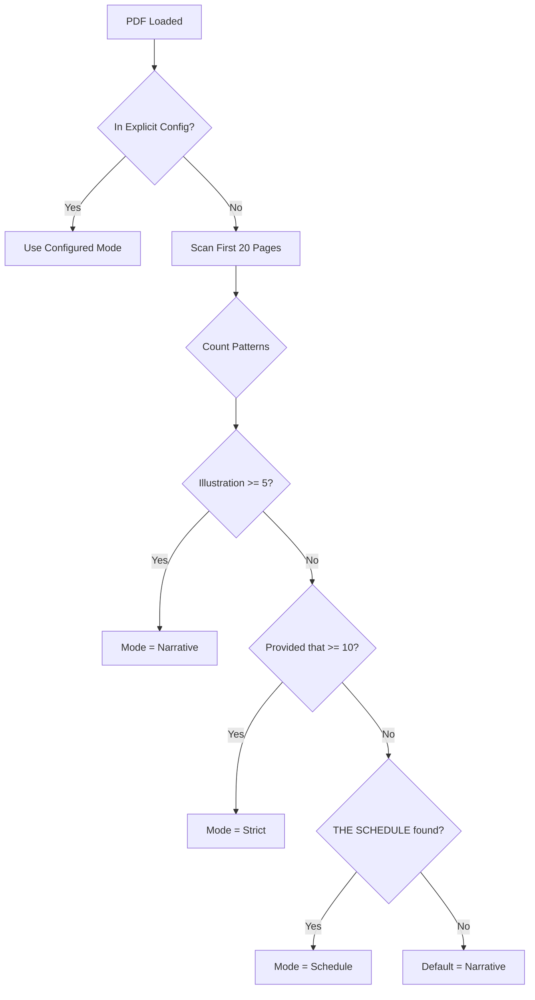

### Explicit Config (`data/parser_modes.json`)

```json
{
  "BNS": "narrative",
  "BSA": "narrative",
  "BNSS": "strict",
  "Income_Tax_Act": "strict",
  "PMLA": "schedule",
  "Contract_Act": "narrative"
}
```

### Content Detection Thresholds

| Pattern | Threshold | Detected Mode |
| :--- | :---: | :--- |
| `Illustration` or `Explanation` | >= 5 | Narrative |
| `Provided that` | >= 10 | Strict |
| `THE SCHEDULE` + table | Found | Schedule |

### Chunking Rules

1. **Section Detection**: New chunk starts with `^\d+[A-Z]?\.\s` (e.g., `3.`, `303.`, `482.`)

2. **Attachment Rules**:
   | Mode | Pattern | Action |
   | :--- | :--- | :--- |
   | Narrative | `Illustration`, `Explanation` | Append to previous Section |
   | Strict | `Provided that` | Append to previous Sub-section |
   | Schedule | Table rows | Each row = separate chunk |

3. **BNSS Schedule Handling**:
   - Format: `[BNSS] > Schedule I > [Offence] : Punishment is [Col2], [Col3], [Col4], triable by [Col5].`

4. **Bridging Logic** (PMLA):
   - Inject: *"Note: IPC Section X corresponds to BNS Section Y"*

5. **Text Enrichment**:
   - Format: `[Act Name] > [Chapter] > [Section ID + Title] : [Content]`

---

## Validation Results

### Acts Analyzed

| Act | Patterns Found | Expected Mode | Validated |
| :--- | :--- | :---: | :---: |
| **BNS** | Illustrations throughout | Narrative | ✅ |
| **BSA** | Illustrations for definitions | Narrative | ✅ |
| **IPC** | Illustrations + Explanations | Narrative | ✅ |
| **Contract Act** | Many Illustrations per section | Narrative | ✅ |
| **BNSS** | Provisos + First Schedule table | Strict + Schedule | ✅ |
| **Income Tax Act** | Heavy "Provided that" provisos | Strict | ✅ |
| **PMLA** | THE SCHEDULE with IPC references | Schedule | ✅ |
| **GST Act** | Provisos + Schedules | Strict + Schedule | ✅ |

### Confidence Assessment

| Scenario | Reliability |
| :--- | :---: |
| Explicit Config | **100%** |
| Content Detection | **~92%** |
| Combined with Fallback | **~97%** |

> [!TIP]
> Edge cases (short acts, mixed styles) can be added to explicit config as discovered.

---

### Strategy Pattern Implementation

```python
class NarrativeStrategy:
    """Attaches Illustrations/Explanations to parent Section."""
    attach_patterns = ["Illustration", "Explanation"]

class StrictStrategy:
    """Attaches Provisos to parent Sub-section."""
    attach_patterns = ["Provided that"]

class ScheduleStrategy:
    """Parses tables row-by-row."""
    trigger = "THE SCHEDULE"
```

### Database & Data Models

#### [NEW] `app/models/`
- `schema.py`: Pydantic models for API requests/responses and MongoDB documents.
    - `LegalChunk`: Strictly matches user's JSON schema.
    - `Metadata`: Nested object for filtering (Act, Category, Section ID).

### MongoDB Data Model (JSON Schema)

The database will store documents with this exact structure:

```json
{
  "_id": "BlackMoney2015_Sec_03",
  "text_for_embedding": "Black Money ... Act, 2015 > Chapter II ... > Section 3 ... [Context: ...]",
  "raw_content": "3. Charge of tax. (1) There shall be charged...",
  "embedding": [0.012, -0.234, "...", 0.987], 
  "metadata": {
    "act_name": "Black Money Act, 2015",
    "category": "Tax",
    "chapter": "II - Basis of Charge",
    "section_id": "3",
    "chunk_type": "Section", 
    "has_illustration": false,
    "has_proviso": true,
    "schedule_bridge": null 
  }
}
```

#### [NEW] `app/services/database.py`
- MongoDB initialization and connection management using `motor` (async).
- Index management references.

### MongoDB Atlas Index Definitions

You must create **two indexes** in MongoDB Atlas UI:

#### 1. Vector Search Index

**Index Name**: `vector_index` (must match `VECTOR_SEARCH_INDEX_NAME` in .env)

```json
{
  "fields": [
    {
      "type": "vector",
      "path": "embedding",
      "numDimensions": 1024,
      "similarity": "cosine"
    },
    {
      "type": "filter",
      "path": "metadata.act_name"
    },
    {
      "type": "filter",
      "path": "metadata.category"
    }
  ]
}
```

#### 2. Text Search Index (BM25)

**Index Name**: `text_index` (must match `BM25_TEXT_INDEX_NAME` in .env)

```json
{
  "mappings": {
    "dynamic": false,
    "fields": {
      "text_for_embedding": {
        "type": "string",
        "analyzer": "lucene.standard"
      },
      "raw_content": {
        "type": "string",
        "analyzer": "lucene.standard"
      }
    }
  }
}
```

### Retrieval Engine (Modular Pattern)

#### [NEW] `app/services/retriever.py`
- **Hybrid Search**:
    - **Vector Search**: Using `LangChain` + `Mistral` embeddings.
    - **Keyword Search**: Using `BM25` on enriched text.
    - **RRF Merge**: Logic to combine results.
- **Reranking**:
    - Integration with `Cohere` reranker to select top 5 chunks.

### LLM & Agent Integration

#### [NEW] `app/services/llm_engine.py`
- **LangChain Abstraction**:
    - `ChatGroq` setup with `Llama-3-70b`.
    - **[NEW] Memory Management**: Use `MongoDBChatMessageHistory` backed by `ConversationSummaryBufferMemory`.
        - **Strategy**: Keep last 5 turns raw; summarize older turns to save tokens.
        - **Model**: Use a smaller, faster model (e.g., Llama-3-8b) for background summarization.
    - `Chain`: `create_history_aware_retriever` to contextualize the query before search.
    - `generate_answer(session_id, query)`: Fetches history auto-magically.

### Scripts & CLI (Batch Processing)

#### [NEW] `scripts/`
- `ingest_batch.py`: Command-line script to process a local directory of PDFs.
    - Iterates through all PDFs in a target folder.
    - Calls `parser.manager` for each file.
    - Bulk upserts chunks to MongoDB for efficiency.
    - Uses `tqdm` for progress bar.
    - **[NEW] Retry Logic**: Implements exponential backoff for failed files (Max retries configured in .env).

### API Layer

#### [NEW] `app/api/`
- `routes.py`: FastAPI endpoints.
    - `POST /ingest`: Accepts List of Files, starts Background Task, returns `job_id`.
    - `GET /ingest/status/{job_id}`: Returns detailed batch progress:
        - `total_files`: 100
        - `processed_count`: 15
        - `current_file`: "IPC.pdf"
        - `current_file_progress`: 45%
    - `POST /chat`: Accepts query, runs Retrieval pipeline, returns Answer + Citations.
- `main.py`: App entry point, CORS config.

## API Specification

| Endpoint | Method | Description | Request Body | Response |
| :--- | :--- | :--- | :--- | :--- |
| `/health` | `GET` | System health check | - | `{"status": "ok"}` |
| `/api/v1/ingest` | `POST` | Start Async Batch Ingestion | `files: List[UploadFile]` | `{"job_id": "uuid", "status": "queued"}` |
| `/api/v1/ingest/status/{id}` | `GET` | Check Batch Progress | - | `{"job_status": "processing", "current_file": "IPC.pdf", "file_progress": 45, "batch_progress": "12/100"}` |
| `/api/v1/chat` | `POST` | Query the RAG system | `{"session_id": "uuid", "query": "..."}` | `{"answer": "...", "sources": [...]}` |
| `/api/v1/search` | `POST` | Direct hybrid search (no LLM) | `{"query": "...", "filters": {"act_name": "..."},  "page": 1}` | `{"results": [...], "total": 150, "page": 1}` |
| `/api/v1/autocomplete` | `GET` | Suggest acts/sections | `?q=sec` | `["Section 302", "Section 304", ...]` |
| `/api/v1/section/{id}/related` | `GET` | Cross-references | - | `[{"act": "BNS", "section": "103", "relation": "replaces IPC 302"}]` |
| `/api/v1/documents` | `GET` | List ingested files (Optional) | - | `[{"filename": "IPC.pdf", "chunk_count": 500}]` |
| `/api/v1/viability` | `POST` | Predict case outcome | `{"facts": "...", "court": "...", "case_type": "..."}` | `{"viability": "HIGH", "confidence": 85, "supporting_cases": [...]}` |
| `/api/v1/arguments` | `POST` | Extract legal arguments | `{"scenario": "..."}` | `{"prosecution": [...], "defense": [...], "winning": "...", "source": "..."}` |
| `/api/v1/clauses` | `POST` | Search legal phrasing | `{"query": "quashing FIR settlement"}` | `[{"text": "...", "source": "Case X, Para 15"}]` |

### Frontend (User Interface)

#### [NEW] `frontend/`
- **React Application** (Vite + Material UI).
    - `App.jsx`: Main layout using MUI `AppBar` and `Grid`.
    - `components/FileUpload.jsx`: stylized Dropzone.
        - **[NEW] Status Polling**: Polls `/ingest/status` every 2s until completion. Shows Progress Bar.
    - `components/SearchInterface.jsx`: Search bar + filters + paginated results list.
    - `components/ChatInterface.jsx`: MUI `Paper` components for chat bubbles, `Chip` for sources.
    - `components/ViabilityPredictor.jsx`: Case facts input, filters, prediction card, supporting cases.
    - `components/ArgumentMiner.jsx`: Scenario input, two-column arguments display, winning highlight.
    - `components/ClauseSearch.jsx`: Search bar, quoted text cards with copy buttons.
    - `api.js`: Axios service.
    - **Theme**: Enterprise Blue (`#1976d2`), Roboto font.


## Verification Plan

### Automated Tests
- **Parser Unit Tests**: Create `tests/test_parser.py` with sample text blocks to verify:
    - Section detection (Regex match).
    - Attachment logic (Illustration/Proviso checks).
    - Schedule mapping (PMLA bridge).
- **Integration Tests**: `tests/test_api.py` to mock DB and LLM, verifying endpoint status codes.

### Manual Verification
1.  **Ingestion Test**:
    - Upload a sample "IPC" PDF (Narrative Mode).
    - Verify in MongoDB Compass that "Illustrations" are appended to the correct Section chunk.
2.  **Search Test**:
    - Query: "What is the punishment for murder?"
    - Verify: Retrieval finds Section 302 (or BNS equivalent).
    - Verify: RRF merges results effectively.
3.  **Bridge Test**:
    - Upload a PMLA Schedule.
    - Context Check: Verify the "Bridge Note" appears in the `text_for_embedding`.
4.  **UI Verification**:
    - Test Drag-and-drop upload.
    - Test Chat interaction and clicking "Source Chips" reveals raw text.
